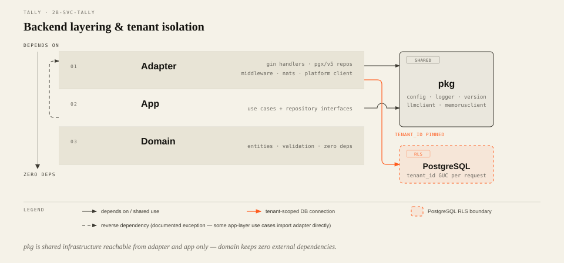

[中文](./README.zh-CN.md) | English

# Lurus Tally

An AI-native purchase-sales-inventory (PSI / "进销存") system for small and mid-size businesses — manufacturing, wholesale, retail, and e-commerce sellers who need multi-warehouse stock control without a heavyweight ERP.

Tally is a Go + Next.js web application, not a CRUD form generator: it ships an in-app AI assistant for natural-language stock queries, an agent-suggested replenishment flow, and a command palette for keyboard-first operation. The backend implements a 4-layer architecture (domain / use case / repository / handler) over PostgreSQL with row-level-security multi-tenancy; the CI pipeline runs unit tests, `testcontainers`-based integration tests, and frontend Vitest + Playwright suites on every push. It is deployed to Lurus's staging environment and has also been packaged and installed twice as a self-hosted Docker Compose deliverable for an external customer (see `deploy/customer/`); it has not yet graduated to the company's production cluster.

## Core Capabilities

- Multi-tenant product, SKU, unit, and multi-warehouse stock management with PostgreSQL RLS tenant isolation (`internal/domain/product/`, `internal/domain/stock/`, `internal/domain/warehouse/`)
- Purchase and sale bill workflows (draft → approve → cancel/restore) driving stock movements and accounts payable/receivable (`internal/app/bill/`, `internal/adapter/handler/bill/`)
- Cross-border currency and exchange-rate tracking for import/export sellers (`internal/domain/currency/`, `internal/app/currency/`)
- AI assistant drawer with streaming chat and a `⌘K` command palette backed by an LLM gateway client (`internal/pkg/llmclient/`, `internal/adapter/handler/ai/`, `web/components/ai-assistant/`, `web/components/command-palette/`)
- Replenishment suggestions, gross-margin/ABC/dead-stock reports, and a weekly "Monday card" digest (`internal/app/replenish/`, `internal/app/reports/`, `internal/app/digest/`)
- A horticulture (nursery/plant retail) vertical pack: a 200-species plant dictionary and project tracking, gated per-tenant behind an industry flag (`internal/domain/horticulture/`, `internal/app/project/`, `web/components/horticulture/`)
- Platform-issued subscription billing, OIDC login (vendor-neutral, works against any standards-compliant IdP), and optional Memorus-backed AI memory recall, each degrading gracefully to a disabled state when unconfigured (`internal/adapter/platform/`, `web/auth.ts`, `internal/pkg/memorusclient/`)

<picture>
  <source media="(prefers-color-scheme: dark)" srcset="docs/diagrams/architecture-dark.svg">
  
</picture>

## Quick Start

Requires Go 1.25+, Bun 1.2+, and Docker Desktop / Compose v2 for local dependencies.

```bash
git clone https://github.com/hanmahong5-arch/lurus-tally.git && cd lurus-tally
cp .env.example .env             # defaults work as-is for local dev

# Backend — starts Postgres + Redis + NATS via Docker, then the Go server
make dev
curl http://localhost:18200/internal/v1/tally/health
# Expected: {"service":"lurus-tally","status":"ok","version":"dev"}

# Frontend (in a second terminal)
cd web
bun install
bun run dev                      # http://localhost:3000
```

```bash
# Tests
go test -count=1 ./...                                 # backend unit tests
go test -v -count=1 -tags=integration -race ./...      # backend integration tests (needs Docker)
cd web && bun run test                                 # frontend Vitest

# Production build
CGO_ENABLED=0 GOOS=linux go build -trimpath -o tally-backend ./cmd/server
cd web && bun run build
```

See `Makefile` for the full target list (`migrate-up`, `migrate-down`, `lint`, `docker-build`, `coverage`, …).

## Architecture

The backend follows a strict 4-layer package layout per business module (`account`, `product`, `stock`, `bill`, `billing`, `horticulture`, `project`, …):

```
internal/
├── domain/<module>/     # entities, validation, domain constants — no external deps
├── app/<module>/        # use cases (Create/Get/List/Update/Delete/Restore) + Repository interfaces
├── adapter/
│   ├── repo/<module>/   # Repository implementations — raw SQL via database/sql + pgx/v5, no ORM
│   ├── handler/<module>/ # Gin HTTP handlers + request/response DTOs
│   ├── middleware/       # auth, tenant-DB pinning, idempotency, body limits, request timeout, metrics
│   ├── platform/         # Lurus Platform client (identity, billing, notification)
│   └── nats/             # NATS JetStream publisher (PSI_EVENTS stream)
├── pkg/                 # config, logger, llmclient, memorusclient, version, ...
└── lifecycle/app.go     # dependency injection: repo -> use case -> handler -> router.New(...)

cmd/
├── server/              # main API server entry point
├── tally-mcp/           # MCP (Model Context Protocol) server binary
└── kill-switch-monitor/ # standalone monitor binary shipped alongside the API image

web/
├── app/(dashboard)/     # authenticated app routes (Next.js App Router route group)
├── app/(auth)/          # login/auth routes
├── components/          # ai-assistant, command-palette, horticulture, project, pos, draft, undo, ...
├── lib/                 # api client, billing, draft (IndexedDB), undo stack
└── auth.ts              # NextAuth.js OIDC (PKCE) configuration

migrations/              # golang-migrate SQL migrations, embedded into the binary via embed.go
deploy/
├── k8s/                 # Kustomize base + stage/prod overlays
└── customer/            # self-hosted Docker Compose install package (INSTALL.md, acceptance.sh)
```

Database access is raw SQL through `database/sql` + `jackc/pgx/v5` (no ORM); tenant isolation is enforced by PostgreSQL row-level security, with `internal/adapter/middleware/tenant_db.go` pinning each request to a connection carrying `app.tenant_id`.

The inward-dependency direction shown in the diagram above is the target, not an absolute: a handful of `app/<module>` use cases import `adapter/middleware` (e.g. to emit metrics) or a concrete `adapter/repo/<module>` package directly instead of going through the injected `Repository` interface — a documented layering exception, not a hidden one.

## Configuration

Full reference: `.env.example`. Key variables:

| Variable | Required | Default | Description |
|---|---|---|---|
| `DATABASE_DSN` | yes | — | PostgreSQL DSN; should include `search_path=tally` |
| `REDIS_URL` | yes | — | Redis connection URL (DB 5 is reserved for Tally) |
| `NATS_URL` | yes | — | NATS URL; the `PSI_EVENTS` JetStream stream is auto-created on boot |
| `PORT` | no | `18200` | HTTP listen port |
| `LOG_LEVEL` | no | `info` | `debug` \| `info` \| `warn` \| `error` |
| `GIN_MODE` | no | `release` | `debug` \| `release` |
| `SHUTDOWN_TIMEOUT` | no | `5s` | Graceful shutdown deadline |
| `MIGRATE_ON_BOOT` | no | `true` | Run embedded migrations on service startup |
| `PLATFORM_INTERNAL_KEY` | for platform features | empty | Bearer key for calls to platform-core |
| `PLATFORM_BASE_URL` | for platform features | `http://platform-core.lurus-platform.svc:18104` | platform-core internal URL; billing calls error if unset |
| `NEWAPI_API_KEY` | no | empty | LLM gateway (newapi) API key; AI features disable cleanly when blank |
| `NEWAPI_BASE_URL` | no | `https://newapi.lurus.cn/v1` | LLM gateway base URL |
| `KOVA_URL` | no | empty | Kova agent-execution endpoint; agent features disable when blank |
| `MEMORUS_BASE_URL` | no | `http://memorus-r.lurus-system.svc:8880/api/v1` | AI memory engine base URL (must include `/api/v1`) |
| `MEMORUS_API_KEY` | no | empty | Blank disables memory recall; AI still works without it |
| `OIDC_ISSUER` | for auth | empty | OIDC issuer (bare host or full URL); if left empty the service **fails to start** unless `TALLY_DEV_MODE=true` is also set, since an unset issuer would otherwise leave `/api/v1` unauthenticated |
| `OIDC_CLIENT_ID` | for auth | empty | Confidential OIDC client ID |
| `OIDC_AUDIENCE` | for auth | empty | Expected `aud` claim |
| `OIDC_JWKS_PATH` | no | `/oauth/v2/keys` | JWKS path appended to the issuer |
| `SEED_NURSERY_DICT` | no | `false` | Load the 200-species nursery seed data on startup (idempotent) |
| `TALLY_NOTIFY_WECOM_WEBHOOK` / `TALLY_NOTIFY_DINGTALK_WEBHOOK` / `TALLY_NOTIFY_FEISHU_WEBHOOK` | no | empty | Group-bot notification webhooks (currently not wired into the DI graph — see `.env.example` comments) |

## API Overview

All business routes are mounted under `/api/v1` (see `internal/adapter/handler/router/router.go`); `/internal/v1/tally/health` and `/internal/v1/tally/ready` are unauthenticated liveness/readiness probes, and `/internal/v1/metrics` exposes Prometheus-format LLM observability metrics behind a bearer-token gate.

| Group | Examples |
|---|---|
| Auth & tenant profile | `GET /api/v1/me`, `POST /api/v1/tenant/profile`, PAT CRUD under `/api/v1/auth/pats` |
| Products & units | `/api/v1/products`, `/api/v1/units` |
| Stock | `GET /api/v1/stock/snapshots`, `/api/v1/stock/movements`, `/api/v1/stock/alerts/low-stock` (read-only; mutations happen via bill approval) |
| Purchase / sale bills | `/api/v1/purchase-bills`, `/api/v1/sale-bills`, `/api/v1/sale-bills/quick-checkout` |
| Payments & billing | `/api/v1/payments`, `/api/v1/billing/overview`, `/api/v1/billing/subscribe` |
| AI assistant | `POST /api/v1/ai/chat` (SSE), `/api/v1/ai/plans` (proposal/confirm/cancel/revert) |
| Horticulture & projects | `/api/v1/nursery-dict`, `/api/v1/projects` |
| Suppliers & warehouses | `/api/v1/suppliers`, `/api/v1/warehouses` |
| Reports & search | `/api/v1/reports/{gross-margin,abc,dead-stock,sales-top}`, `/api/v1/search`, `/api/v1/weekly-summary` |
| Exports & imports | `/api/v1/exports/{bills,stock,payments}.csv`, `/api/v1/imports/orders` |
| Account center | `/api/v1/account/{sessions,audit-log,profile,avatar}` |
| Onboarding | `/api/v1/onboarding/{seed-demo,clear-demo}` |

Every write route requires an `Idempotency-Key` header (enforced by `internal/adapter/middleware/idempotency_require.go`), independent of whether the optional Redis-backed dedup layer is active.

## Development Conventions

From this repo's contributor guide:

- Backend: `go run ./cmd/server` (`:18200`); build with `CGO_ENABLED=0 GOOS=linux go build -ldflags="-s -w" -trimpath`.
- Frontend: `bun install` / `bun run dev` / `bun run build` / `bun run lint` — Bun only, no npm/yarn/npx/node.
- License: Apache-2.0 (see `LICENSE`); third-party notices in `NOTICE` and `THIRD_PARTY_LICENSES/`.
- New backend modules follow the same 4-layer package layout described above; adding a handler changes the `router.New(...)` signature, which is a breaking change requiring test and DI updates in the same commit.

## Related Projects

Tally is one of several services in the Lurus platform monorepo and consumes several of its shared capabilities at runtime:

- **platform-core** (`2l-svc-platform`) — identity, subscription billing, and notification, called via `internal/adapter/platform/`
- **LLM gateway** — the platform's OpenAI-compatible inference gateway, called by `internal/pkg/llmclient/` for the AI assistant (`NEWAPI_BASE_URL` / `NEWAPI_API_KEY`)
- **Memorus** — AI memory/recall service, optional dependency via `internal/pkg/memorusclient/`
- **Kova** — agent-execution runtime for the replenishment agent (endpoint configured via `KOVA_URL`; not yet wired to a handler)

## Open-Source Lineage

Data model and schema design borrow from **jshERP** and **GreaterWMS** (Apache-2.0) and **Apache OFBiz** (design patterns); frontend components build on **shadcn/ui + Radix** (MIT) and reference **Medusa.js v2** (MIT). Full attribution in `NOTICE`; third-party dependency licenses are collected in `THIRD_PARTY_LICENSES/` (Go modules) and `web/package.json` (npm packages).
