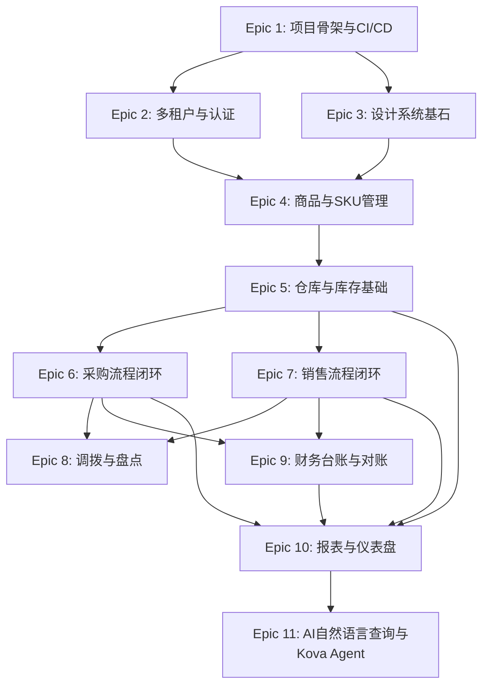

# Epics: Lurus Tally (2b-svc-psi)

源 PRD: `./prd.md` (版本: 1.0, 2026-04-23)
源架构: `./architecture.md` (版本: 1.0, 2026-04-23)
生成时间: 2026-04-23

---

## 1. Executive Summary

| 维度 | 数量 |
|------|------|
| Epic 总数 | 11 |
| Story 总数 | 68 |
| 预估工期（单人全力）| 约 26 个 sprint 周（2 周/sprint = 13 个 sprint） |
| 预估工期（双人并行）| 约 16 个 sprint 周（8 个 sprint） |

**关键里程碑映射**:

| PRD §12 Milestone | 对应完成 Epic | 目标日期 |
|-------------------|--------------|---------|
| MVP α — 骨架可运行 | Epic 1 完成 | M1 W2 |
| MVP α — 核心进销存跑通 | Epic 1-7 完成 | M3 |
| MVP β — AI 差异化功能 + 付费 | Epic 8-10 完成 | M5 |
| MVP β — Kova Agent 上线 | Epic 11 完成 | M6 |

**MVP α 达标条件（Lighthouse 客户可开始真实业务）**:
Epic 1-7 全部完成，即 Story 1.1-7.5 全部通过 acceptance criteria，部署到 Stage 环境。

---

## 2. Epic Dependency Graph

**关键路径**: E1 → E2/E3 → E4 → E5 → E6/E7 → E9 → E10 → E11

**风险优先说明**: Epic 2（RLS 多租户隔离）排在 Epic 3 之前，因为多租户安全是商业 SaaS 的生死线——一旦晚期发现 RLS 与 GORM 的兼容坑，会波及所有业务表。Epic 4 前置 Epic 3（设计系统）而非仅 Epic 2，是因为商品 CRUD 的 UX 组件（Sheet、DataTable、Stepper）是后续所有业务模块复用的基础，设计债不应累积到 Sprint 末期再还。

---

## 3. Per-Epic Detail

---

## Epic 1: 项目骨架与 CI/CD 管线

**目标**: 开发者 `git clone` 后一条命令启动完整本地开发环境；GitHub Actions 流水线绿色通过；镜像可推送至 GHCR；ArgoCD App 已注册到 lurus-tally namespace。

**价值**: PRD §12 W1-W2 工程里程碑；确保后续所有 Epic 在正确的技术底座上构建。

**依赖**: 无（第一个 Epic）

**风险**: Go module 路径与 GHCR 私有镜像认证设置是典型踩坑点；Next.js standalone 模式与 Bun 在 Docker 多阶段构建中的兼容性需要实测验证。

**预估**: 7 个 Story × 平均 6 小时 = 42 小时

**Definition of Done**:
- `make dev` 或等效命令启动后端 :18200 + 前端 :3000，均可访问健康检查端点
- `go test ./...` 通过（初始 0 个测试也算，但 test harness 必须可运行）
- GitHub Actions `ci.yml` 通过 lint → typecheck → test → build → push 全流程
- ArgoCD application `lurus-tally` 已创建，指向 `deploy/k8s/overlays/stage`
- `migrations/` 12 个文件在 `migrate up` 后 tally schema 所有 27 张表已创建

### Stories

| # | Story Title | 类型 | 工时 | 关键文件/模块 |
|---|------------|------|------|--------------|
| 1.1 | Go 服务可启动并通过健康检查 | infra | 6h | `cmd/server/main.go`, `lifecycle/`, `pkg/config/` |
| 1.2 | Next.js 前端可访问登录页占位 | infra | 4h | `web/app/layout.tsx`, `web/app/(auth)/login/page.tsx` |
| 1.3 | 数据库迁移脚本完整执行（全 27 张表） | infra | 6h | `migrations/000001~000012_*.up.sql`, `lifecycle/migrate.go` |
| 1.4 | GitHub Actions CI 流水线（lint/typecheck/test/build） | infra | 5h | `.github/workflows/ci.yml` |
| 1.5 | Docker 多阶段构建与 GHCR 镜像推送 | infra | 5h | `Dockerfile`, `.github/workflows/ci.yml` (push job) |
| 1.6 | ArgoCD ApplicationSet 注册与 K8s 基础清单 | infra | 5h | `deploy/k8s/base/`, `deploy/argocd/` |
| 1.7 | 本地开发 Makefile + 环境变量模板 | infra | 3h | `Makefile`, `.env.example` |

### Story 大纲

#### Story 1.1 — Go 服务可启动并通过健康检查
- **As a** 开发者, **I want** Go 服务在配置正确时正常启动, **so that** 后续业务代码有可运行的宿主
- **Acceptance Criteria**:
  - Given 环境变量配置完整，When 执行 `go run ./cmd/server/`，Then `:18200/internal/v1/tally/health` 返回 `{"status":"ok"}`
  - Given 缺少必填环境变量 `DATABASE_DSN`，When 启动，Then 进程以非零退出码退出并打印明确错误（启动即校验原则）
- **Tech Notes**:
  - 涉及表: 无（仅连接池 ping）
  - 涉及组件: `lifecycle/app.go`（DI 根）, `lifecycle/start.go`, `pkg/config/config.go`
  - 涉及 API: `GET /internal/v1/tally/health`
- **Test Plan**:
  - Unit: `pkg/config/` — 缺环境变量时 fast-fail 逻辑
  - Integration: `TestHealthEndpoint_Returns200` (testcontainers-go, PostgreSQL)
- **Out of Scope**: 业务路由、认证中间件

#### Story 1.2 — Next.js 前端可访问登录页占位
- **As a** 开发者, **I want** Next.js 前端在 :3000 可访问，**so that** 前端构建链路验证通过
- **Acceptance Criteria**:
  - Given Bun 环境就绪，When `bun run dev`，Then `localhost:3000/login` 返回 200，页面包含"登录"文案
  - Given `bun run build`，Then 构建成功，无 TypeScript 错误
- **Tech Notes**:
  - 涉及组件: `web/app/(auth)/login/page.tsx`, `web/styles/globals.css`（OKLCH 主题变量），`web/app/layout.tsx`（ThemeProvider）
  - next.config.ts 启用 `output: "standalone"`
- **Test Plan**:
  - `bun run typecheck && bun run lint` 通过
- **Out of Scope**: Zitadel OIDC 实际集成（Epic 2 做）

#### Story 1.3 — 数据库迁移脚本完整执行（全 27 张表）
- **As a** 开发者, **I want** `golang-migrate up` 后 tally schema 所有表已创建，**so that** 后续 Story 可以直接写入数据
- **Acceptance Criteria**:
  - Given 空 PostgreSQL，When 运行迁移，Then `SELECT COUNT(*) FROM information_schema.tables WHERE table_schema='tally'` 返回 27+（含物化视图）
  - Given 重复运行迁移，Then 幂等，无错误
- **Tech Notes**:
  - 涉及文件: `migrations/000001~000012_*.up.sql`（架构 §5.2 完整 DDL）
  - `lifecycle/migrate.go` 在启动时自动执行 `migrate up`
  - 包含 RLS policy（`000012_init_rls.up.sql`）、物化视图（`000011_init_views.up.sql`）
- **Test Plan**:
  - Integration: `TestMigration_AllTablesExist` (testcontainers-go)
- **Out of Scope**: 种子数据

#### Story 1.4 — GitHub Actions CI 流水线
- **As a** 开发者, **I want** 每次 push 自动运行 lint/typecheck/test/build，**so that** 主干质量有保障
- **Acceptance Criteria**:
  - Given PR 提交，When CI 触发，Then lint (golangci-lint + ESLint) → typecheck (tsc --noEmit) → test (go test + bun test) → build 四个 job 全绿
  - Given 任意 job 失败，Then PR 被阻止合并
- **Tech Notes**:
  - 涉及文件: `.github/workflows/ci.yml`
  - Go CI: `golangci-lint run`, `go test -race ./...`
  - Frontend CI: `bunx tsc --noEmit`, `bun run lint`, `bun run test`
- **Out of Scope**: 镜像推送（Story 1.5）

#### Story 1.5 — Docker 多阶段构建与 GHCR 镜像推送
- **As a** 运维, **I want** 每次 main 分支合并后自动构建镜像并推送 GHCR，**so that** ArgoCD 可以自动拉取最新版本
- **Acceptance Criteria**:
  - Given main 分支合并，When CI 完成，Then `ghcr.io/hanmahong5-arch/lurus-tally:main-<sha7>` 可被 `docker pull`
  - 后端 Dockerfile 使用 `FROM scratch` + CGO_ENABLED=0；前端使用 `output: standalone`
- **Tech Notes**:
  - 镜像命名: `ghcr.io/hanmahong5-arch/lurus-tally:main-<sha7>`（架构 §1 + decision-lock §5）
  - Trivy 扫描作为 non-blocking 警告
- **Out of Scope**: ArgoCD 自动同步（Story 1.6）

#### Story 1.6 — ArgoCD ApplicationSet 注册与 K8s 基础清单
- **As a** 运维, **I want** ArgoCD 能管理 lurus-tally 的部署，**so that** GitOps 闭环打通
- **Acceptance Criteria**:
  - Given ArgoCD app 已创建，When 推送新镜像 tag，Then Stage 环境的 Pod 自动更新
  - `kubectl get pods -n lurus-tally` 显示 tally-backend 和 tally-web Pod Running
- **Tech Notes**:
  - 涉及文件: `deploy/k8s/base/` (Deployment/Service/ConfigMap), `deploy/k8s/overlays/stage/`
  - Namespace: `lurus-tally`（decision-lock §5）
  - backend port: 18200；前端通过 Next.js standalone 内嵌
- **Out of Scope**: Prod overlay（Stage 先行）

#### Story 1.7 — 本地开发 Makefile + 环境变量模板
- **As a** 新加入开发者, **I want** 一个 `.env.example` 和 `make dev` 命令快速启动本地环境，**so that** 减少首次上手摩擦
- **Acceptance Criteria**:
  - `.env.example` 包含所有必填环境变量及说明注释
  - `make dev` 启动 PostgreSQL（Docker Compose）+ Go 后端 + Next.js 前端，并在 health 通过后打印 URL
- **Out of Scope**: Zitadel 本地模拟（用测试 tenant 绕过）

---

## Epic 2: 多租户与认证基础

**目标**: 用户可以通过 Zitadel OIDC 登录；注册后自动创建 tenant 记录；所有 API 请求携带 JWT，经过 `tenant_rls.go` 中间件注入 `app.tenant_id`，PostgreSQL RLS 隔离生效；RBAC 四角色权限控制在 API 层生效。

**价值**: PRD §4.1 模块1 (US-1.1, US-1.2)；PRD §7.3 安全合规；决策锁 §3 第1条

**依赖**: Epic 1

**风险**: GORM 与 PostgreSQL RLS 的结合——GORM 默认连接池会复用连接，`SET LOCAL app.tenant_id` 必须在每个事务内生效，需要实测并加 E2E 测试覆盖"跨租户查询返回空集"场景，否则数据泄露风险极高。

**预估**: 6 个 Story × 平均 6 小时 = 36 小时

**Definition of Done**:
- Zitadel OIDC 登录 → 回调 → Session Cookie 全链路可跑通（可使用 tally-stage.lurus.cn 的 OIDC client）
- `TestRLS_CrossTenantQueryReturnsEmpty` 集成测试通过
- 四角色权限矩阵测试：仓管角色访问财务端点返回 403

### Stories

| # | Story Title | 类型 | 工时 | 关键文件/模块 |
|---|------------|------|------|--------------|
| 2.1 | 用户可用 Zitadel OIDC 完成登录与登出 | feat | 7h | `web/app/(auth)/`, `lib/auth.ts`, `adapter/middleware/auth.go` |
| 2.2 | 登录后自动创建/同步租户记录 | feat | 5h | `app/tenant/`, `adapter/platform/tenant.go`, `migrations/000002` |
| 2.3 | API 请求全局注入租户上下文（RLS 激活） | feat | 6h | `adapter/middleware/tenant_rls.go` |
| 2.4 | 跨租户数据隔离 E2E 验证 | test | 4h | `tests/integration/rls_isolation_test.go` |
| 2.5 | RBAC 四角色权限矩阵实施 | feat | 6h | `adapter/middleware/auth.go`, `pkg/types/role.go` |
| 2.6 | 企业设置向导（新租户引导三步流程） | feat | 5h | `web/app/(dashboard)/settings/`, `components/form-builder/stepper.tsx` |

### Story 大纲

#### Story 2.1 — 用户可用 Zitadel OIDC 完成登录与登出
- **As a** 新用户, **I want** 点击"登录"后跳转 Zitadel，完成认证后回到 Tally，**so that** 无需另外注册账号
- **Acceptance Criteria**:
  - Given 用户访问受保护页面，When 未登录，Then 自动跳转 `/login`
  - Given 用户在 Zitadel 完成认证，When OIDC callback，Then Session 建立，跳转 Dashboard
  - Given 用户点击"退出"，When 执行登出，Then Session 清除，重定向到登录页
- **Tech Notes**:
  - 涉及组件: `web/lib/auth.ts`（NextAuth Zitadel provider），`web/app/api/auth/[...nextauth]/route.ts`
  - 后端: `adapter/middleware/auth.go`（JWT 签名验证，Zitadel JWKS endpoint）
- **Test Plan**:
  - Integration: mock Zitadel callback，验证 session cookie 写入
  - E2E: Playwright 测试登录完整流程

#### Story 2.2 — 登录后自动创建/同步租户记录
- **As a** 新用户, **I want** 首次登录后系统自动创建我的企业空间，**so that** 不需要额外的"开通"步骤
- **Acceptance Criteria**:
  - Given 首次登录，When JWT 中 `org_id` 存在，Then `tally.tenant` 中自动 upsert 对应记录
  - Given Platform 同步回调 `/internal/v1/tally/tenant/sync`，When 租户状态变更，Then 本地缓存更新
- **Tech Notes**:
  - 涉及表: `tally.tenant`（`migrations/000002_init_tenant.up.sql`）
  - 涉及组件: `adapter/platform/tenant.go`，`app/tenant/sync_tenant.go`
- **Test Plan**:
  - Unit: `TestSyncTenant_NewTenant_CreatesRecord`
  - Integration: 验证 Platform bearer key 认证

#### Story 2.3 — API 请求全局注入租户上下文（RLS 激活）
- **As a** 系统, **I want** 每个 API 请求自动设置 `SET LOCAL app.tenant_id`，**so that** 所有数据库查询自动被 RLS 隔离
- **Acceptance Criteria**:
  - Given 已认证请求，When 进入 Gin handler，Then 当前连接执行 `SET LOCAL app.tenant_id = '<uuid>'`
  - Given `app.tenant_id` 未设置，When 查询任意表，Then 返回空集（不返回所有租户数据）
- **Tech Notes**:
  - 涉及组件: `adapter/middleware/tenant_rls.go`（Gin middleware，使用 GORM BeforeCreate callback 注入）
  - GORM 连接池注意：使用 `db.Exec("SET LOCAL app.tenant_id = ?", tenantID)` 在事务内
- **Out of Scope**: 超级管理员绕过 RLS（另外用 admin 账户连接实现）

#### Story 2.4 — 跨租户数据隔离 E2E 验证
- **As a** 安全审计员, **I want** 有自动化测试证明租户 A 的数据不会被租户 B 读取，**so that** 多租户安全有客观证明
- **Acceptance Criteria**:
  - Given 租户 A 创建了 3 个商品，When 用租户 B 的 JWT 查询商品列表，Then 返回空数组
  - Given 租户 B 尝试直接访问租户 A 的商品 ID，When `GET /api/v1/products/:id`，Then 返回 404（而非 403，不泄露存在性）
- **Tech Notes**:
  - 涉及文件: `tests/integration/rls_isolation_test.go`
  - 使用 testcontainers-go 启动真实 PostgreSQL

#### Story 2.5 — RBAC 四角色权限矩阵实施
- **As a** 企业管理员, **I want** 邀请成员时分配角色，**so that** 不同角色只能访问其职责范围
- **Acceptance Criteria**:
  - 管理员: 全部权限
  - 仓管: 可操作采购/销售/调拨/盘点/库存，不可访问财务台账 `/api/v1/finance/*`
  - 业务员: 可读库存，可创建销售单，不可修改成本价字段
  - 只读: GET 系列端点，POST/PATCH/DELETE 返回 403
- **Tech Notes**:
  - 角色信息从 Zitadel JWT claim 读取，或存 `tally.org_user_rel`
  - 涉及组件: `adapter/middleware/auth.go`（`RequireRole(roles...)` helper）
  - 涉及表: `tally.org_user_rel`, `tally.org_department`
- **Test Plan**:
  - Unit: `TestRBACMiddleware_WarehouseRole_BlocksFinance`

#### Story 2.6 — 企业设置向导（新租户引导三步流程）
- **As a** 新注册老板, **I want** 首次登录后看到三步引导向导，**so that** 快速完成企业基础配置
- **Acceptance Criteria**:
  - 步骤 1: 填写公司名称/行业/规模 → 存 `tally.tenant.settings` JSONB
  - 步骤 2: 创建第一个仓库（调用 `POST /api/v1/warehouses`）
  - 步骤 3: 选"演示数据"或"空白开始"（演示数据 seed 脚本）
  - 完成后跳转 Dashboard，空状态引导 CTA 显示（ux-benchmarks P7）
- **Tech Notes**:
  - 涉及组件: `components/form-builder/stepper.tsx`，`web/app/(dashboard)/settings/page.tsx`
  - 向导完成状态存 `tenant.settings.onboarding_done: true`，二次登录不再弹出

---

## Epic 3: 设计系统基石

**目标**: 开发者可以从组件库中组装出任意业务页面；⌘K Command Palette、AI Drawer、暗黑模式、DataTable、Sheet 等核心组件均可独立 demo；新业务 Story 的前端开发时间中，UI 组件复用比例 ≥ 70%。

**价值**: PRD §8（UX 原则 P1-P10 全部落地）；决策锁 §4 客户体验原则；架构 §4 前端组件树

**依赖**: Epic 1

**风险**: shadcn/ui 2025 版本迁移 OKLCH 色彩空间时，与 TailwindCSS v4 结合可能有配置冲突；Framer Motion 动效与 Next.js App Router 服务端组件的边界需要仔细标注 "use client"。

**预估**: 6 个 Story × 平均 5 小时 = 30 小时

**Definition of Done**:
- Storybook 或等效 demo 页可展示所有核心组件
- ⌘K 打开 Command Palette，输入关键词可导航
- AI Drawer 右侧滑出，展示流式文本输出占位
- 暗黑/亮色模式切换无闪烁

### Stories

| # | Story Title | 类型 | 工时 | 关键文件/模块 |
|---|------------|------|------|--------------|
| 3.1 | 主题系统与暗黑模式（OKLCH 色彩空间） | feat | 4h | `styles/globals.css`, `components/ui/`, `stores/sidebar-store.ts` |
| 3.2 | 可折叠侧边栏与顶栏主布局 | feat | 5h | `components/layout/sidebar.tsx`, `components/layout/topbar.tsx` |
| 3.3 | DataTable 通用封装（TanStack Table + 骨架屏） | feat | 6h | `components/data-table/` |
| 3.4 | ⌘K Command Palette 框架 | feat | 5h | `components/command-palette/`, `hooks/use-command-palette.ts` |
| 3.5 | AI Drawer 框架（流式输出占位） | feat | 5h | `components/ai-drawer/`, `stores/ai-drawer-store.ts` |
| 3.6 | Slide-over Sheet、空状态组件、Toast 系统 | feat | 4h | `components/slide-over/`, `components/layout/empty-state.tsx` |

### Story 大纲

#### Story 3.1 — 主题系统与暗黑模式
- **As a** 用户, **I want** 界面默认深色主题，切换时无闪烁，**so that** 长时间工作不眼疲劳
- **Acceptance Criteria**:
  - 默认加载深色主题（decision-lock §4 第7条）
  - 主题切换通过 `next-themes` 持久化 localStorage；页面刷新不闪白
  - 所有 shadcn/ui 组件在亮色/暗色下均视觉一致
- **Tech Notes**:
  - `styles/globals.css` 使用 OKLCH 色彩变量（亮色 + 暗色两套）
  - `web/app/layout.tsx` 包裹 `ThemeProvider`

#### Story 3.2 — 可折叠侧边栏与顶栏主布局
- **As a** 仓管, **I want** 侧边栏可折叠到 icon-only 模式，**so that** 在 1280px 屏幕上有更大操作区域
- **Acceptance Criteria**:
  - 展开 220px icon+文字；折叠 48px icon-only；Framer Motion 动效 200ms
  - 折叠状态 hover icon 显示 Tooltip（含快捷键，ux-benchmarks P10）
  - 状态通过 `sidebar-store.ts` 持久化 localStorage
- **Tech Notes**:
  - 涉及组件: `components/layout/sidebar.tsx`（Zustand），`components/layout/topbar.tsx`

#### Story 3.3 — DataTable 通用封装
- **As a** 开发者, **I want** 一个开箱即用的 TanStack Table 封装，**so that** 每个列表页不需要重复实现排序/分页/筛选
- **Acceptance Criteria**:
  - 支持 server-side 分页（cursor-based）、排序、关键词搜索
  - 支持表格密度三档（Compact/Regular/Relaxed: 40/48/56px），localStorage 持久化（ux-benchmarks P3）
  - 行 hover 显示操作按钮（ux-benchmarks P5）；首次加载显示骨架屏（ux-benchmarks P8）
  - 数字列右对齐 + tabular-nums + 千分位（ux-benchmarks P4）
- **Tech Notes**:
  - 涉及组件: `components/data-table/data-table.tsx`（TanStack Table v8）
  - 虚拟滚动（TanStack Virtual）v1 不开启，留 API 接口

#### Story 3.4 — ⌘K Command Palette 框架
- **As a** 任意用户, **I want** ⌘K 弹出命令面板，可搜索导航和操作，**so that** 无需记住菜单路径
- **Acceptance Criteria**:
  - 任意页面按 ⌘K（或 Ctrl+K）弹出；Escape 关闭
  - 分组显示：导航类（页面跳转）、操作类（新建单据）、AI 查询入口
  - 输入文字实时过滤；键盘 ↑↓ 选择，Enter 执行
  - AI 查询：输入"？"前缀或选择"AI 助手"分组 → 触发 AI Drawer 打开（Epic 11 接入真实 API）
- **Tech Notes**:
  - 基于 `cmdk` 库；`components/command-palette/commands.ts` 定义命令表
  - `hooks/use-command-palette.ts` 全局键盘监听（document level）

#### Story 3.5 — AI Drawer 框架（流式输出占位）
- **As a** 用户, **I want** 右侧 AI Drawer 滑出后展示流式 Markdown 输出，**so that** 不遮挡主内容的同时获得 AI 分析
- **Acceptance Criteria**:
  - Drawer 从右侧滑入，宽度 400px，不遮罩背景（ux-benchmarks P12）
  - 支持 Markdown 表格、代码块渲染
  - 流式输出时显示光标闪烁；消息中可嵌入操作按钮（点击跳转）
  - v1 占位：输入任意文字返回 mock 流式响应（Epic 11 对接 Hub API）
- **Tech Notes**:
  - 涉及组件: `components/ai-drawer/ai-drawer.tsx`，`use-ai-chat.ts`（Vercel AI SDK `useChat`）
  - `stores/ai-drawer-store.ts`（Zustand：开关状态 + 当前对话 ID）

#### Story 3.6 — Slide-over Sheet、空状态组件与 Toast 系统
- **As a** 开发者, **I want** 通用的 Slide-over Sheet、空状态引导组件和 Toast 通知，**so that** 业务 Story 可以直接复用
- **Acceptance Criteria**:
  - Sheet: 右侧滑入，背景主列表仍可见（ux-benchmarks P1）；支持 `size: sm/md/lg`
  - 空状态: 接受 `icon/title/description/actions` props，actions 为 CTA 按钮（ux-benchmarks P7）
  - Toast: 乐观更新场景支持 `[撤销]` 按钮（3s 超时，ux-benchmarks P6）；失败时变红
- **Tech Notes**:
  - Toast 使用 `sonner` 库；`components/slide-over/slide-over.tsx`（Framer Motion）

---

## Epic 4: 商品与 SKU 管理

**目标**: 管理员可以创建商品、定义 SKU 矩阵、批量导入 Excel；仓管可以用条码枪扫码定位 SKU；安全库存阈值可配置并触发预警状态。

**价值**: PRD §4.1 模块2 (US-2.1~2.6)；PRD §6.1 商品模块 P0 功能全部落地

**依赖**: Epic 2（租户上下文）, Epic 3（DataTable/Sheet/组件库）

**风险**: 批量 Excel 导入 500 行 < 5s 的性能目标——需要使用 excelize 流式读取而非全量加载内存，且需要并发写入 PostgreSQL（batch insert）；条码扫码 < 300ms 需要 Redis 缓存 barcode → SKU ID 映射，避免全表扫描。

**预估**: 8 个 Story × 平均 6 小时 = 48 小时

**Definition of Done**:
- 商品 CRUD 完整（含 SKU 矩阵、批次/序列号开关）
- Excel 导入 500 行 < 5s 验收通过（含集成测试）
- 条码扫码 < 300ms（Redis 缓存路径测试）
- `migrations/000005_init_product.up.sql` 中所有表均被测试覆盖

### Stories

| # | Story Title | 类型 | 工时 | 关键文件/模块 |
|---|------------|------|------|--------------|
| 4.1 | 商品列表与全文搜索 | feat | 5h | `app/product/query_product.go`, `handler/v1/product.go`, `web/app/products/page.tsx` |
| 4.2 | 新建/编辑商品（Sheet 表单 + 分类树） | feat | 6h | `app/product/create_product.go`, `web/components/form-builder/` |
| 4.3 | SKU 属性矩阵与多单位换算 | feat | 6h | `domain/entity/product_sku.go`, `domain/entity/unit.go`, `handler/v1/sku.go` |
| 4.4 | 批次管理与序列号管理（商品级开关） | feat | 5h | `domain/entity/stock_lot.go`, `domain/entity/stock_serial.go` |
| 4.5 | 条码扫码定位 SKU（< 300ms） | feat | 4h | `adapter/repo/product_sku_repo.go`（Redis 缓存），`pkg/` |
| 4.6 | 安全库存阈值设置与预警状态 | feat | 4h | `domain/entity/stock_initial.go`, `app/stock/alert_stock.go` |
| 4.7 | Excel 批量导入商品（500 行 < 5s） | feat | 7h | `app/product/import_product.go`, `handler/v1/product.go POST /import` |
| 4.8 | 商品停售/下架与软删除 | feat | 3h | `app/product/delete_product.go`, `query_product.go`（过滤下架商品） |

### Story 大纲

#### Story 4.1 — 商品列表与全文搜索
- **As a** 管理员, **I want** 在商品列表页看到所有商品并能快速搜索，**so that** 快速定位目标商品
- **Acceptance Criteria**:
  - 搜索框输入商品名/助记码/条码，实时过滤（debounce 300ms）
  - 列表显示名称/SKU 数/库存状态 Badge/分类
  - 首次加载骨架屏，无数据时显示引导 CTA
- **Tech Notes**:
  - 涉及表: `product`, `product_sku`, `product_category`
  - API: `GET /api/v1/products?search=&category_id=&page=`（cursor 分页）
  - 助记码 `mnemonic` 字段：服务端汉字转拼音首字母（`github.com/mozillazg/go-pinyin`）

#### Story 4.2 — 新建/编辑商品
- **As a** 管理员, **I want** 点击"新建商品"后从右侧 Sheet 滑入填写表单，**so that** 背景商品列表仍可见
- **Acceptance Criteria**:
  - Sheet 内表单：必填字段（名称/分类/编码）校验；分类用树形下拉选择
  - 乐观更新：提交后 Toast "商品已创建" + [撤销] 3s
  - 编辑时支持修改除租户 ID 外所有字段；软删除不影响历史单据
- **Tech Notes**:
  - 涉及表: `product`, `product_category`（树形 CTE 查询）
  - 涉及组件: `components/slide-over/slide-over.tsx`, `components/form-builder/form-field.tsx`

#### Story 4.3 — SKU 属性矩阵与多单位换算
- **As a** 管理员, **I want** 定义属性组（颜色 × 尺码）后自动生成 SKU 矩阵，**so that** 批量创建变体不需要逐条录入
- **Acceptance Criteria**:
  - 属性组：颜色[红/蓝/白] × 尺码[S/M/L] → 自动生成 9 个 SKU
  - 每个 SKU 独立设置条码/采购价/零售价/最低价
  - 多单位：基础单位"件"+ 辅助单位"箱（12 件/箱）"，开单时可选单位
- **Tech Notes**:
  - 涉及表: `product_attribute`, `product_sku`, `unit`
  - API: `POST /api/v1/products/:id/skus`（批量创建 SKU）

#### Story 4.4 — 批次管理与序列号管理
- **As a** 管理员, **I want** 对食品类商品开启批次管理，**so that** 入库时强制录批号/有效期，先进先出出库
- **Acceptance Criteria**:
  - `product.enable_lot_no = true` 时，入库单明细必须填写 `lot_no` + `expiry_date`
  - 出库时系统按 `expiry_date` 升序建议批次（先进先出）
  - `product.enable_serial_no = true` 时，入库时录入序列号列表；出库后序列号可溯源到销售单
- **Tech Notes**:
  - 涉及表: `stock_lot`, `stock_serial`
  - `bill_item.lot_id` FK 到 `stock_lot`；`bill_item.serial_nos TEXT[]`

#### Story 4.5 — 条码扫码定位 SKU（< 300ms）
- **As a** 仓管, **I want** 扫码枪扫码后立即定位到 SKU，**so that** 开单时不用手动搜索
- **Acceptance Criteria**:
  - HID 键盘模式：页面输入框自动捕获焦点，扫码枪输入 + Enter → 触发搜索
  - Redis 缓存 `tally:sku:barcode:<tenantId>:<barcode>` → `sku_id`（5 分钟 TTL）
  - 全链路（前端→后端→Redis→返回）< 300ms P99
- **Tech Notes**:
  - API: `GET /api/v1/skus?barcode=<code>`（优先 Redis 缓存，miss 时查 PostgreSQL 并回填）
  - Redis DB 5（decision-lock §5）

#### Story 4.6 — 安全库存阈值与预警状态
- **As a** 管理员, **I want** 为每个 SKU 设置安全库存下限，**so that** 库存接近下限时系统自动标红
- **Acceptance Criteria**:
  - `stock_initial.low_safe_qty` 可在商品详情 → 仓库配置中设置
  - 库存 < 50% 阈值：黄色 Badge；< 20%：红色 Badge
  - Dashboard 待办卡片聚合低库存预警（预留接口，Epic 10 展示）
- **Tech Notes**:
  - 涉及表: `stock_initial`（`low_safe_qty`, `high_safe_qty`）
  - 涉及组件: `app/stock/alert_stock.go`（每小时扫描，详见架构 §2 worker）

#### Story 4.7 — Excel 批量导入商品（500 行 < 5s）
- **As a** 管理员, **I want** 上传填好的 Excel 模板后批量创建商品，**so that** 从旧系统迁移不需要逐条手录
- **Acceptance Criteria**:
  - 提供 `.xlsx` 模板下载（含示例行 + 字段说明）
  - 上传后解析：正确行实时预览绿色；错误行标红并显示原因（如"条码重复"）
  - 确认导入 500 行 < 5s（并发 batch insert，PostgreSQL COPY 或 ON CONFLICT DO NOTHING）
  - 错误行不阻断正确行入库
- **Tech Notes**:
  - 使用 `github.com/xuri/excelize/v2` 流式读取
  - API: `POST /api/v1/products/import`（multipart form-data）
  - 超 100 行时异步处理 + Toast 通知（WebSocket push）

#### Story 4.8 — 商品停售与软删除
- **As a** 管理员, **I want** 将不再销售的商品下架，**so that** 开单搜索时不再出现，但历史单据仍可查
- **Acceptance Criteria**:
  - 停售商品在 `/api/v1/products` 默认不返回（`WHERE enabled=true AND deleted_at IS NULL`）
  - 历史 `bill_item` 中的商品记录保持完整（外键约束 + 软删除）
  - 已下架商品可重新启用

---

## Epic 5: 仓库与库存基础

**目标**: 管理员可以创建多个仓库；仓管可以查看任意 SKU 在任意仓库的六状态实时库存；WAC 成本算法在每次入库后自动重算；库存流水 `stock_ledger` 每笔变动可追溯。

**价值**: PRD §4.1 模块3 (US-3.1~3.3)；PRD §6.2 仓库模块 P0；PRD §6.3 库存模块 P0

**依赖**: Epic 4（商品数据）

**风险**: 库存六状态的并发更新——多张单据同时操作同一 SKU 时，`available_qty = on_hand_qty - reserved_qty` 的计算必须在数据库事务内原子完成，否则超卖。需要 PostgreSQL `SELECT FOR UPDATE` 或乐观锁（Redis 版本号），应在 Story 中明确使用哪种方案。

**预估**: 5 个 Story × 平均 5 小时 = 25 小时

**Definition of Done**:
- 仓库 CRUD + 库存六状态查询 API 完整
- WAC 成本重算逻辑有单元测试覆盖（≥ 4 种场景）
- `TestStockConcurrentUpdate_NoOversell` 并发测试通过

### Stories

| # | Story Title | 类型 | 工时 | 关键文件/模块 |
|---|------------|------|------|--------------|
| 5.1 | 仓库创建与管理 | feat | 4h | `app/warehouse/`, `handler/v1/warehouse.go`, `migrations/000006` |
| 5.2 | 库存六状态实时查询（多仓库视图） | feat | 5h | `app/stock/query_stock.go`, `domain/entity/stock_snapshot.go` |
| 5.3 | WAC 移动加权平均成本算法 | feat | 6h | `app/stock/` WAC 计算逻辑 |
| 5.4 | 库存流水追溯（stock_ledger） | feat | 5h | `domain/entity/stock_ledger.go`（新增），`adapter/repo/stock_repo.go` |
| 5.5 | 库存快照物化视图刷新与报表用查询 | feat | 4h | `migrations/000011_init_views.up.sql`, Worker 定时刷新 |

### Story 大纲

#### Story 5.1 — 仓库创建与管理
- **As a** 管理员, **I want** 创建多个仓库并设置名称/地址/负责人，**so that** 多仓库分开管理
- **Acceptance Criteria**:
  - 仓库 CRUD；同租户内仓库名唯一
  - 仓库列表默认仓库标注"默认"Badge
  - 设置 → 仓库管理页面（`web/app/(dashboard)/settings/warehouses/page.tsx`）
- **Tech Notes**:
  - 涉及表: `warehouse`（`migrations/000006_init_stock.up.sql` 包含）

#### Story 5.2 — 库存六状态实时查询
- **As a** 仓管, **I want** 查看每个 SKU 的在手/可用/预占/在途/损坏/冻结六个数字，**so that** 知道哪些库存可以发货
- **Acceptance Criteria**:
  - `GET /api/v1/stocks?warehouse_id=&product_id=` 返回六状态值
  - `available_qty = on_hand_qty - reserved_qty`（实时计算，非定时）
  - 支持"全仓"汇总视图（GROUP BY product_id）
  - `channel_id` 字段默认 `default`，渠道筛选列 UI 预留但禁用（US-3.3）
- **Tech Notes**:
  - 涉及表: `stock_snapshot`；并发更新使用 `SELECT FOR UPDATE`

#### Story 5.3 — WAC 移动加权平均成本算法
- **As a** 财务, **I want** 每次采购入库后系统自动重算 WAC，**so that** 库存价值报表始终准确
- **Acceptance Criteria**:
  - 入库 100 件 @ ¥10，再入库 50 件 @ ¥13 → WAC = (100×10 + 50×13) / 150 = ¥10.67
  - 出库时记录当时的 WAC 成本（不影响 WAC 本身）
  - WAC 存 `stock_snapshot.avg_cost_price`，精度 NUMERIC(18,6)
- **Tech Notes**:
  - 涉及表: `stock_snapshot`, `bill_item`
  - 涉及函数: `app/stock/` WAC 计算（在审核入库单时触发，事务内）
- **Test Plan**:
  - Unit: `TestWAC_TwoInbounds`, `TestWAC_PartialInbound`, `TestWAC_ZeroQtyEdgeCase`

#### Story 5.4 — 库存流水追溯
- **As a** 财务/审计, **I want** 每笔库存变动都有流水记录（来源单据/时间/操作人），**so that** 库存差异可追溯
- **Acceptance Criteria**:
  - 每次 `stock_snapshot` 变更同时写入 `stock_ledger`（PRD 要求，架构 §5.2 中描述）
  - 流水记录包含: `change_type/qty_before/qty_after/ref_bill_id/ref_bill_type/user_id`
  - `GET /api/v1/stocks/:sku_id/ledger` 返回该 SKU 全部流水（分页）
- **Tech Notes**:
  - `stock_ledger` 为新增表（architecture.md 中未列，需补充 migration `000006`）
  - 涉及组件: `adapter/repo/stock_repo.go`（`AppendLedger` 事务内调用）

#### Story 5.5 — 库存快照物化视图刷新
- **As a** 报表系统, **I want** `report_stock_summary` 物化视图定期刷新，**so that** 报表查询无需扫全表
- **Acceptance Criteria**:
  - Worker 每 5 分钟执行 `REFRESH MATERIALIZED VIEW CONCURRENTLY tally.report_stock_summary`
  - 刷新期间不阻塞读查询（CONCURRENTLY 关键字）
  - 低库存预警 `is_low_stock` 字段在刷新后更新
- **Tech Notes**:
  - 涉及文件: `lifecycle/worker.go`（定时任务注册），`migrations/000011_init_views.up.sql`

---

## Epic 6: 采购流程闭环

**目标**: 采购员可以创建草稿采购单 → 提交审核 → 仓管确认入库（含部分入库）→ 库存自动增加 → WAC 重算；财务可以录入付款记录并查看应付状态；支持反审和红冲。

**价值**: PRD §4.1 模块4 (US-4.1~4.4)；PRD §6.4 采购模块 P0 全部落地；PRD §12 W5-W6 里程碑

**依赖**: Epic 5（仓库与库存）

**风险**: 状态机完整性——采购单有 7 个状态（草稿/已提交/已审核/部分入库/完成/取消/已冲销），状态转换规则如果没有统一的状态机实现（而是散落在各 handler 里），后期 bug 难以追踪。建议使用枚举状态机模式，在 Story 6.1 中确定。

**预估**: 7 个 Story × 平均 5.5 小时 = 38 小时

**Definition of Done**:
- 完整采购单状态机测试（覆盖所有合法/非法状态转换）
- 入库确认后 `stock_snapshot.on_hand_qty` 精确增加，WAC 重算
- 红冲后原单状态"已冲销"，反向入库单生成，审计日志记录
- 应付台账查询接口正确反映付款进度

### Stories

| # | Story Title | 类型 | 工时 | 关键文件/模块 |
|---|------------|------|------|--------------|
| 6.1 | 创建采购单草稿（Stepper 三步 + 行内编辑） | feat | 7h | `app/purchase/create_purchase.go`, `web/app/purchases/new/page.tsx` |
| 6.2 | 采购单提交审核与状态机流转 | feat | 5h | `app/purchase/submit_purchase.go`, `approve_purchase.go`, `pkg/types/bill_status.go` |
| 6.3 | 采购入库确认（全量/部分入库 + WAC 重算） | feat | 6h | `app/purchase/receive_purchase.go`, `app/stock/` WAC |
| 6.4 | 采购单应付款管理（多次付款录入） | feat | 5h | `app/finance/create_payment.go`, `domain/entity/payment_head.go` |
| 6.5 | 采购单反审与红冲（数据完整性保护） | feat | 6h | `app/purchase/cancel_purchase.go`, 红字单据生成逻辑 |
| 6.6 | 采购单列表与详情页 | feat | 4h | `web/app/purchases/page.tsx`, `[id]/page.tsx`, `components/bill/` |
| 6.7 | 采购退货（退供应商）处理 | feat | 5h | `app/purchase/` 退货子流程, `bill_type=出库, sub_type=采购退货` |

### Story 大纲

#### Story 6.1 — 创建采购单草稿
- **As a** 采购员, **I want** 用三步 Stepper 创建采购单，**so that** 步骤清晰不容易遗漏字段
- **Acceptance Criteria**:
  - Step 1: 选供应商（搜索/新建）+ 日期/备注
  - Step 2: 添加 SKU 明细（搜索 SKU + 扫码）+ 数量/单价行内编辑 + 实时小计汇总
  - Step 3: 确认并提交（或保存草稿）
  - 草稿自动保存（⌘S），离开页面有"未保存"提示
  - 提交后生成 `PO-YYYYMMDD-XXX` 编号（`bill_sequence` 表）
- **Tech Notes**:
  - 涉及表: `bill_head`, `bill_item`, `bill_sequence`, `partner`
  - 涉及组件: `components/form-builder/stepper.tsx`, `components/bill/bill-item-table.tsx`

#### Story 6.2 — 采购单提交审核与状态机流转
- **As a** 采购员, **I want** 提交草稿后进入审核流程，**so that** 防止未经确认的采购单影响账务
- **Acceptance Criteria**:
  - 状态转换: 草稿(0) → 已提交(1) → 已审核(2) | 已驳回
  - 非法转换（如草稿直接跳完成）返回 400 错误
  - 审核通过不立即入库，等待仓管确认入库（Story 6.3）
- **Tech Notes**:
  - 涉及文件: `pkg/types/bill_status.go`（状态枚举 + 合法转换表）
  - 涉及函数: `app/purchase/submit_purchase.go`, `approve_purchase.go`

#### Story 6.3 — 采购入库确认
- **As a** 仓管, **I want** 扫码确认收到货物并录入实收数量，**so that** 库存精确增加
- **Acceptance Criteria**:
  - 支持全量收货（一次性）和部分收货（多次）
  - 入库确认后: `stock_snapshot.on_hand_qty` += 入库数量；WAC 重算（Story 5.3 逻辑）
  - 批次商品: 入库时强制录入 `lot_no` + `expiry_date`
  - NATS `PSI_EVENTS` 发布 `psi.stock.changed` 事件
- **Tech Notes**:
  - 涉及函数: `app/purchase/receive_purchase.go`
  - 所有库存变更在 PostgreSQL 事务内：`bill_head` 更新 + `stock_snapshot` 更新 + `stock_ledger` 写入

#### Story 6.4 — 采购单应付款管理
- **As a** 财务, **I want** 录入每次付款金额和日期，**so that** 应付台账实时反映付款进度
- **Acceptance Criteria**:
  - 采购单详情页显示：应付总额 / 已付 / 剩余应付
  - 可录入多次付款（`payment_head` 记录），每次指定金额/日期/账户/备注
  - 全额付清后状态自动更新为"已结清"
- **Tech Notes**:
  - 涉及表: `payment_head`, `payment_item`, `finance_account`
  - `bill_head.paid_amount` 在付款后累加更新

#### Story 6.5 — 采购单反审与红冲
- **As a** 采购员, **I want** 对已审核采购单进行红冲，**so that** 纠正错误时账面保持完整性
- **Acceptance Criteria**:
  - 反审：审核(2) → 草稿(0)，仅限未入库的采购单
  - 红冲（已入库）：原单状态 → "已冲销"；生成反向入库单（`bill_type=出库, sub_type=采购退货`）；库存自动减少
  - 所有操作写入 `audit_log`（who/what/result）
- **Tech Notes**:
  - `bill_head.amendment_of_id` FK 关联原单，追溯红冲关系
  - 涉及函数: `app/purchase/cancel_purchase.go`

#### Story 6.6 — 采购单列表与详情页
- **As a** 采购员, **I want** 在采购单列表中按状态/时间/供应商筛选，**so that** 快速找到需要处理的单据
- **Acceptance Criteria**:
  - 列表支持状态筛选 Badge（草稿/待入库/已完成）
  - 状态颜色语义化（ux-benchmarks P16）：草稿=灰/待审=黄/审核=蓝/完成=绿/取消=红
  - 点击行→ Slide-over Sheet 侧滑出详情（ux-benchmarks P1）
- **Tech Notes**:
  - 涉及组件: `components/bill/bill-detail-sheet.tsx`, `bill-status-badge.tsx`

#### Story 6.7 — 采购退货处理
- **As a** 采购员, **I want** 对已入库商品发起退货，**so that** 退回次品时库存和应付账款正确减少
- **Acceptance Criteria**:
  - 退货单引用原采购入库单，不能超退
  - 退货出库确认后: `stock_snapshot.on_hand_qty` -= 退货数量；`bill_head.paid_amount` 相应抵减
  - 退货单独立编号 `PR-YYYYMMDD-XXX`

---

## Epic 7: 销售流程闭环

**目标**: 业务员可以创建销售单 → 超库存预警 → 审核 → 出库确认 → 库存扣减 → 应收台账更新；财务可以录入收款；支持红冲（销售退货）；支持打印送货单。

**价值**: PRD §4.1 模块5 (US-5.1~5.4)；PRD §6.5 销售模块 P0 全部落地；PRD §12 W7-W8 里程碑

**依赖**: Epic 5（库存）, Epic 6（应付参考结构复用，尤其收付款设计）

**风险**: 超卖控制——销售单提交时校验 `available_qty` 足够，但从"提交"到"出库确认"中间可能有并发超卖。需要在出库确认时再次加锁（`SELECT FOR UPDATE`），并在 Story 7.3 中明确这个设计。

**预估**: 7 个 Story × 平均 5.5 小时 = 38 小时

**Definition of Done**:
- 销售单完整状态机测试（含超库存场景）
- 出库确认后 `stock_snapshot.on_hand_qty` 精确减少
- 应收台账按客户分组正确汇总
- 打印销售单含公司抬头和中文大写金额

### Stories

| # | Story Title | 类型 | 工时 | 关键文件/模块 |
|---|------------|------|------|--------------|
| 7.1 | 创建销售单（客户选择 + SKU 明细 + 折扣） | feat | 7h | `app/sales/create_sales.go`, `web/app/sales/new/page.tsx` |
| 7.2 | 库存实时校验与超库存行内警告 | feat | 4h | `app/sales/submit_sales.go`, 前端实时库存查询 |
| 7.3 | 出库确认（全量/部分出库 + 并发锁保护） | feat | 6h | `app/sales/ship_sales.go`, PostgreSQL FOR UPDATE |
| 7.4 | 销售单应收款管理与超期标红 | feat | 5h | `app/finance/`, `partner.ar_balance` 更新 |
| 7.5 | 销售退货（红冲）与库存恢复 | feat | 5h | `app/sales/cancel_sales.go`, 退货入库单生成 |
| 7.6 | 销售单打印（送货单/对账单 + 中文大写金额） | feat | 5h | `styles/print.css`, `web/app/sales/[id]/` 打印视图 |
| 7.7 | 销售单列表与详情页 | feat | 4h | `web/app/sales/page.tsx`, `[id]/page.tsx` |

### Story 大纲

#### Story 7.1 — 创建销售单
- **As a** 业务员, **I want** 用三步 Stepper 创建销售单，**so that** 在客户现场也能快速完成开单
- **Acceptance Criteria**:
  - Step 1: 选客户（搜索/快速新建）
  - Step 2: 添加 SKU 明细；行内显示当前可用库存；支持扫码枪输入
  - Step 3: 选仓库/付款方式/备注，整单折扣输入
  - 提交生成 `SO-YYYYMMDD-XXX` 编号
- **Tech Notes**:
  - 可用库存实时查询（前端每行 SKU 变更时异步请求 `GET /api/v1/stocks?sku_id=`）
  - 行级折扣 + 整单折扣均支持（US-5.2）

#### Story 7.2 — 库存实时校验与超库存行内警告
- **As a** 业务员, **I want** 输入超过库存的数量时看到行内警告，**so that** 不会提交超卖的销售单
- **Acceptance Criteria**:
  - 行内输入数量 > `available_qty` 时，该行显示橙色警告"库存不足（可用 X 件）"
  - 允许保存草稿（不阻断），不允许提交出库（阻断）
  - 提交时后端再次校验，防止并发超卖（乐观锁）
- **Tech Notes**:
  - 前端: TanStack Query 缓存可用库存（60s TTL，手动 invalidate 后更新）
  - 后端: `app/sales/submit_sales.go` 提交时 `SELECT FOR UPDATE stock_snapshot`

#### Story 7.3 — 出库确认与并发锁保护
- **As a** 仓管, **I want** 确认实际出库数量后库存精确扣减，**so that** 系统库存与实物一致
- **Acceptance Criteria**:
  - 支持部分出库（分批发货），`bill_head.purchase_status` 跟踪完成度
  - 出库确认：`stock_snapshot.on_hand_qty` -= 出库数量；`available_qty` 同步更新
  - 批次商品：优先按最近到期批次出库（FIFO 批次，非 FIFO 成本）
  - 并发场景：两个仓管同时确认同一销售单 → 第二个操作返回 409 冲突

#### Story 7.4 — 销售单应收款管理与超期标红
- **As a** 财务, **I want** 录入每笔收款后应收台账实时更新，**so that** 知道哪些客户有欠款
- **Acceptance Criteria**:
  - 应收台账按客户分组：总应收/已收/待收/超期（按配置天数计算）
  - 超期应收自动标红（默认 30 天，可配置 `system_config`）
  - 收款完成后 `partner.ar_balance` 同步更新

#### Story 7.5 — 销售退货与库存恢复
- **As a** 财务, **I want** 对已出库销售单发起退货，**so that** 客户退货时账面和库存都正确
- **Acceptance Criteria**:
  - 退货入库单引用原销售出库单，数量不超过原单
  - 库存恢复: `stock_snapshot.on_hand_qty` += 退货数量
  - 应收自动抵减；审计日志记录操作人
  - 退货单编号 `SR-YYYYMMDD-XXX`

#### Story 7.6 — 销售单打印
- **As a** 业务员, **I want** 在客户现场打印送货单，**so that** 提供专业的纸质凭证
- **Acceptance Criteria**:
  - 打印视图隐藏侧边栏/顶栏，显示公司 Logo/抬头/单据明细/中文大写合计金额（ux-benchmarks P15）
  - 支持"送货单"和"对账单"两种模板
  - `react-to-print` 触发，支持 A4 和 A5 纸
- **Tech Notes**:
  - 涉及文件: `web/styles/print.css`；`formatCNY()` 工具函数（中文大写）

#### Story 7.7 — 销售单列表与详情页
- **As a** 业务员, **I want** 在销售单列表快速找到任意单据并查看详情，**so that** 随时跟进订单状态
- **Acceptance Criteria**:
  - 按状态/客户/时间范围筛选
  - 待出库状态高亮提醒（ux-benchmarks P16）
  - 详情 Sheet 含收款记录时间线

---

## Epic 8: 调拨与盘点

**目标**: 仓管可以创建跨仓调拨单（含在途状态和部分收货）；支持整仓盘点和循环盘点（按类别不关仓）；盘点差异审核通过后库存自动调平；损耗出库记录完整。

**价值**: PRD §4.1 模块6 (US-6.1~6.3)；PRD §6.6 调拨与盘点 P0；PRD Journey 4 和 Journey 8

**依赖**: Epic 6（采购流程闭环，理解状态机设计）, Epic 7（销售流程闭环，共享 bill_head 模型）

**风险**: 循环盘点的并发控制——盘点任务进行中时，其他单据仍在出入库，盘点快照的时间点一致性是个挑战。v1 使用"快照入账面库存 + 盘点完成时校验差异"的简单模型，不做实时锁仓。

**预估**: 5 个 Story × 平均 5 小时 = 25 小时

**Definition of Done**:
- 调拨单在途状态正确（A 仓减少/B 仓增加时序正确）
- 盘点任务差异审核后库存精确调平
- `TestStocktake_DiffApproved_StockAdjusted` 集成测试通过

### Stories

| # | Story Title | 类型 | 工时 | 关键文件/模块 |
|---|------------|------|------|--------------|
| 8.1 | 跨仓调拨单（含在途状态与部分收货） | feat | 6h | `app/transfer/`, `handler/v1/transfer.go`, `web/app/transfers/` |
| 8.2 | 整仓盘点任务创建与快照 | feat | 5h | `app/stocktake/create_stocktake.go` |
| 8.3 | 盘点实盘录入（扫码/行内输入/进度条） | feat | 5h | `app/stocktake/record_stocktake.go`, `web/app/stocktakes/[id]/page.tsx` |
| 8.4 | 盘点差异审核与库存调平 | feat | 5h | `app/stocktake/finalize_stocktake.go` |
| 8.5 | 循环盘点（按商品分类/不关仓）与损耗出库 | feat | 5h | 循环盘点任务管理，`bill_type=出库/sub_type=损耗` |

### Story 大纲

#### Story 8.1 — 跨仓调拨单
- **As a** 仓管, **I want** 创建从 A 仓到 B 仓的调拨单，**so that** 库存在仓库间平衡
- **Acceptance Criteria**:
  - 提交调拨单: A 仓 `available_qty` -= 调拨数量，`in_transit_qty` += 调拨数量
  - B 仓确认收货: `in_transit_qty` -= 收货数量，B 仓 `on_hand_qty` += 收货数量
  - 支持部分收货（B 仓只收到 80%，剩余 20% 继续在途）
  - A 仓 `available_qty` 不足时提交报错（Journey 8 验收）

#### Story 8.2 — 整仓盘点任务创建与快照
- **As a** 仓管, **I want** 发起整仓盘点时系统生成当前账面库存快照，**so that** 盘点有参考基准
- **Acceptance Criteria**:
  - 创建盘点任务：选仓库 → 系统拉取 `stock_snapshot` 当前值作为"应盘数量"冻结快照
  - 快照存入 `bill_item.qty`（账面）字段
  - 任务状态: 进行中/待审核/已完成

#### Story 8.3 — 盘点实盘录入
- **As a** 仓管, **I want** 用条码枪扫码后直接在对应行录入实盘数量，**so that** 盘点高效准确
- **Acceptance Criteria**:
  - 盘点界面顶部进度条（已盘 / 总数）
  - 扫码 → 自动定位 SKU 行，光标跳至"实盘数量"列
  - Tab 跳下一行，Enter 确认；差异 > 5% 红色高亮
  - 实时计算差异列（Journey 4 验收标准：-5 件/-5% 红色高亮）

#### Story 8.4 — 盘点差异审核与库存调平
- **As a** 管理员, **I want** 审核盘点差异报告，**so that** 库存数据与实物一致
- **Acceptance Criteria**:
  - 审核通过: 正差（盘盈）→ 生成入库单；负差（盘亏）→ 生成出库单；库存调平
  - `stock_ledger` 记录"盘点调平 ±N"及操作人
  - 盘点完成后任务状态 → "已完成"，归档

#### Story 8.5 — 循环盘点与损耗出库
- **As a** 仓管, **I want** 选择部分 SKU 盘点（不关仓），**so that** 日常循环盘点不影响出库
- **Acceptance Criteria**:
  - 循环盘点：选择"按商品分类"或"自定义 SKU 列表"创建局部盘点任务
  - 盘点进行中的 SKU 打"盘点中"标记（不锁库存，仅标注）
  - 损耗出库：创建 `bill_type=出库, sub_type=损耗` 的单据，库存减少有记录

---

## Epic 9: 财务台账与对账

**目标**: 财务可以查看应收账款台账（按客户/时间/状态）和应付账款台账（按供应商）；支持多资金账户；超期应收自动标红并触发 Dashboard 预警卡片；台账可导出 Excel。

**价值**: PRD §4.1 模块7 (US-7.1~7.3)；PRD §6.7 财务台账 P0 全部落地；PRD Journey 6

**依赖**: Epic 6（应付台账数据）, Epic 7（应收台账数据）

**风险**: 大客户应收历史数据量大时，按客户分组汇总查询可能很慢。需要 `partner.ar_balance/ap_balance` 实时聚合字段（Epic 6/7 中已更新），台账查询直接读聚合字段 + 按需展开明细，避免全表 SUM。

**预估**: 5 个 Story × 平均 5 小时 = 25 小时

**Definition of Done**:
- 应收/应付台账查询 API P95 < 200ms（数据量 1000 条）
- Excel 导出含中文大写金额，能被 WPS 正确打开
- 超期逻辑单元测试覆盖（边界条件：恰好第 30 天）

### Stories

| # | Story Title | 类型 | 工时 | 关键文件/模块 |
|---|------------|------|------|--------------|
| 9.1 | 应收账款台账（按客户分组 + 超期标红） | feat | 6h | `app/finance/query_payment.go`, `web/app/finance/page.tsx` |
| 9.2 | 应付账款台账（按供应商 + 付款进度） | feat | 4h | 复用应收结构，供应商维度 |
| 9.3 | 多资金账户管理（银行/支付宝/微信/现金） | feat | 4h | `domain/entity/finance_account.go`, `web/app/finance/accounts/page.tsx` |
| 9.4 | 收付款记录详情与单据关联 | feat | 4h | `web/app/finance/payments/page.tsx`, `components/bill/bill-detail-sheet.tsx` |
| 9.5 | 台账 Excel 导出（含公司抬头 + 中文大写） | feat | 4h | `app/finance/` 导出逻辑，`excelize` |

### Story 大纲

#### Story 9.1 — 应收账款台账
- **As a** 财务, **I want** 查看每个客户的应收汇总，**so that** 月末对账一目了然
- **Acceptance Criteria**:
  - 台账列：客户名 / 总应收 / 已收 / 待收 / 超期金额（超期天数可配置）
  - 超期金额 > 0 时该行红色高亮
  - 点击客户行 → 展开该客户所有相关销售单及收款进度
  - API: `GET /api/v1/partners/:id/ar_ap?type=ar` 返回台账数据

#### Story 9.2 — 应付账款台账
- **As a** 财务, **I want** 查看每个供应商的应付汇总，**so that** 控制现金流节奏
- **Acceptance Criteria**:
  - 与应收台账对称结构（供应商维度，未付/部分付/已结清）
  - 支持按"到期日"排序，即将到期的用黄色预警

#### Story 9.3 — 多资金账户管理
- **As a** 财务, **I want** 管理多个资金账户并查看余额，**so that** 清楚每个账户的现金状况
- **Acceptance Criteria**:
  - 支持银行账户/支付宝/微信/现金（可自定义名称和初始余额）
  - `finance_account.current_balance` 在每次收付款后实时更新
  - 账户列表显示余额 + 本月流入/流出汇总

#### Story 9.4 — 收付款记录详情与单据关联
- **As a** 财务, **I want** 查看每笔收付款与对应单据的关联，**so that** 对账时有完整链路
- **Acceptance Criteria**:
  - `payment_head.related_bill_id` 可跳转到对应销售单/采购单
  - 付款记录时间线展示（最新在上）

#### Story 9.5 — 台账 Excel 导出
- **As a** 财务, **I want** 一键导出当月台账 Excel，**so that** 给会计师时不需要手工整理
- **Acceptance Criteria**:
  - 导出内容：公司名称/报表标题/日期范围/数据明细/合计行/中文大写合计
  - 文件名: `应收台账_202604.xlsx`；列宽自适应内容
  - 导出 < 3s（1000 行以内同步，以上异步通知）

---

## Epic 10: 报表与仪表盘

**目标**: 老板可以在 Dashboard 看到 4 个 KPI 卡（含 Sparkline + 环比）；库存周转率/ABC 分析/滞销预警报表可查；Dashboard 待办卡片聚合低库存预警；首屏 LCP < 1.5s。

**价值**: PRD §4.1 模块8 (US-8.1~8.4)；PRD §6.8 报表 P0；PRD §7.1 性能预算

**依赖**: Epic 5（库存数据）, Epic 6（采购数据）, Epic 7（销售数据）, Epic 9（财务数据）

**风险**: 报表查询性能——库存周转率计算需要 JOIN `bill_item` 历史流水全表，数据量大时可能超过 1s。需要预计算策略（物化视图 `report_stock_summary` 或 Redis 缓存），在 Story 10.2 中确定方案。

**预估**: 6 个 Story × 平均 5 小时 = 30 小时

**Definition of Done**:
- Dashboard 首屏 LCP < 1.5s（Lighthouse 测试，在 Stage 环境）
- 四个报表均有完整 UI 和 API，支持时间范围筛选
- `report_stock_summary` 物化视图刷新后报表数据正确

### Stories

| # | Story Title | 类型 | 工时 | 关键文件/模块 |
|---|------------|------|------|--------------|
| 10.1 | 仪表盘 KPI 卡片（4 指标 + Sparkline + 环比） | feat | 6h | `web/app/(dashboard)/page.tsx`, `components/charts/kpi-card.tsx` |
| 10.2 | 库存周转率报表（按商品/分类） | feat | 5h | `app/report/stock_report.go`, `web/app/reports/stock/page.tsx` |
| 10.3 | ABC 分析报表（A/B/C 分类自动计算） | feat | 5h | `app/report/stock_report.go` ABC 算法 |
| 10.4 | 滞销预警报表（阈值可配置） | feat | 4h | `app/report/stock_report.go` 滞销查询 |
| 10.5 | Dashboard 待办卡片系统（预警聚合） | feat | 5h | `web/app/(dashboard)/page.tsx` 待办区 |
| 10.6 | 销售趋势图与报表 Excel 导出 | feat | 5h | `app/report/sales_report.go`, `components/charts/` |

### Story 大纲

#### Story 10.1 — 仪表盘 KPI 卡片
- **As a** 老板, **I want** 打开 Dashboard 5 秒内看懂本月业务状态，**so that** 不需要进入各子模块
- **Acceptance Criteria**:
  - 四卡：本月销售额 / 本月毛利率 / 当前库存总价值 / 应收欠款总额
  - 每卡含：当前值 + 环比箭头（↑↓）+ 7 天 Sparkline（Tremor + Recharts）
  - 首屏 LCP < 1.5s（KPI 数据 API 需加 Redis 缓存，TTL 5 分钟）
- **Tech Notes**:
  - API: `GET /api/v1/reports/sales?period=this_month` 等
  - `components/charts/kpi-card.tsx` 复用（Epic 3 预留位）

#### Story 10.2 — 库存周转率报表
- **As a** 老板, **I want** 查看每个商品/品类的库存周转率，**so that** 找出资金占压严重的品类
- **Acceptance Criteria**:
  - 周转率 = 出库成本 / 平均库存价值（自定义时间范围）
  - 按商品维度和按分类维度两个 Tab
  - 支持 Excel 导出
- **Tech Notes**:
  - 使用物化视图 `report_stock_summary`，避免实时计算
  - 对于自定义时间范围查询，查 `stock_ledger` + 时间范围内 `bill_item`

#### Story 10.3 — ABC 分析报表
- **As a** 老板, **I want** 看到按销售额排名的 A/B/C 类 SKU 分布，**so that** 聚焦管理高价值 SKU
- **Acceptance Criteria**:
  - A 类: 前 20% SKU 贡献 80% 销售额（帕累托原则）
  - 列表带 A/B/C 标签，按销售额降序；支持重算（选时间段）
  - PieChart 展示三类占比（`components/charts/abc-pie-chart.tsx`）

#### Story 10.4 — 滞销预警报表
- **As a** 老板, **I want** 看到超过 N 天未动销的 SKU 列表，**so that** 主动清理积压
- **Acceptance Criteria**:
  - 可配置滞销天数阈值（默认 30 天，存 `system_config`）
  - 列表: SKU 名 / 库存量 / 库存金额 / 最后出库时间 / 滞销天数
  - 支持"按库存金额降序"排列（找金额最大的积压）

#### Story 10.5 — Dashboard 待办卡片系统
- **As a** 老板, **I want** Dashboard 上看到需要处理的待办事项，**so that** 优先处理最重要的问题
- **Acceptance Criteria**:
  - 待办类型: 低库存预警 / 超期应收 / 盘点待审核 / AI 建议（Epic 11 接入）
  - 每类待办显示数量和金额摘要；点击跳转对应模块
  - 待办卡片空状态显示"暂无待处理事项"（非空白页）

#### Story 10.6 — 销售趋势图与报表导出
- **As a** 老板, **I want** 查看近 30 天按品类/按时间的销售趋势折线图，**so that** 发现季节性规律
- **Acceptance Criteria**:
  - Recharts AreaChart，X 轴为日期，Y 轴为销售额；可选品类筛选
  - 所有报表页面底部有"导出 Excel"按钮
  - `components/charts/sales-bar-chart.tsx` 可复用

---

## Epic 11: AI 自然语言查询与 Kova Agent

**目标**: 用户可以通过 ⌘K → AI Drawer 用自然语言查询库存/销售/财务数据；Kova Agent 每日运行补货建议和滞销预警，建议卡片出现在 Dashboard 待办区；用户可对建议采纳/忽略/暂缓。

**价值**: PRD §4.1 模块9 (US-9.1~9.3)；PRD §6.9 AI 助手 P0 全部落地；PRD §9 AI 差异化策略；决策锁 §3 第8/9条

**依赖**: Epic 10（报表数据完整，AI 查询才有意义）

**风险**: Hub API P95 响应 < 3s（含流式首字节 < 1.5s）在中国大陆网络环境下可能不稳定；Kova Agent 对 PSI 数据的 function calling 工具集需要仔细设计——工具过多会影响 LLM 准确率。应在 Story 11.1 中先实现 2-3 个核心工具（库存查询/销售查询），验证延迟基准，再扩展。这是 PRD 第二大风险（§11.1），放最后一个 Epic 但非最低优先——AI 是差异化核心，必须在 MVP α 就能 demo。

**预估**: 6 个 Story × 平均 7 小时 = 42 小时

**Definition of Done**:
- ⌘K → AI Drawer 全链路测试（mock Hub API），首字节 < 1.5s 有量化测试
- Kova Agent 每日运行脚本，建议写入 `agent_recommendations` 表
- Dashboard 待办区展示 AI 建议卡片，采纳/忽略/暂缓逻辑完整
- Hub 工具调用 function registry 覆盖 6 类查询（PRD Journey 5）

### Stories

| # | Story Title | 类型 | 工时 | 关键文件/模块 |
|---|------------|------|------|--------------|
| 11.1 | Hub AI 自然语言查询（SSE 流式 + Function Calling 基础工具集） | feat | 8h | `app/ai_agent/chat.go`, `function_registry.go`, `adapter/hub/` |
| 11.2 | AI Drawer 对接真实 Hub API（流式渲染 + 操作嵌入按钮） | feat | 6h | `components/ai-drawer/`, `use-ai-chat.ts` 对接 |
| 11.3 | ⌘K AI 查询入口与自然语言识别路由 | feat | 5h | `components/command-palette/commands.ts` AI 分组 |
| 11.4 | Kova 补货 Agent（每日运行 + 建议持久化） | feat | 7h | `app/ai_agent/reorder_agent.go`, `adapter/kova/`, `lifecycle/worker.go` |
| 11.5 | Kova 滞销预警 Agent（每日运行 + Dashboard 卡片） | feat | 6h | `app/ai_agent/deadstock_agent.go` |
| 11.6 | 用户对 AI 建议的采纳/忽略/暂缓决策系统 | feat | 5h | `domain/entity/agent_recommendations.go`，`handler/v1/ai.go` |

### Story 大纲

#### Story 11.1 — Hub AI 自然语言查询基础
- **As a** 任意用户, **I want** 用中文提问并获得数据化回答，**so that** 不需要记报表菜单路径
- **Acceptance Criteria**:
  - 支持 6 类查询（PRD Journey 5：库存/销售/应收应付/预警/补货估算/报表生成）
  - Hub 工具集（function calling）: `query_stock`, `query_sales`, `query_ar_ap`, `query_alerts`（v1 最小集）
  - SSE 流式输出，首字节 < 1.5s P95（Hub 侧已有缓存，Tally 侧不重复缓存 LLM 结果）
  - AI 不执行写操作（仅返回数据 + 建议 + 跳转预填链接）
- **Tech Notes**:
  - API: `POST /api/v1/ai/chat`（SSE response，`text/event-stream`）
  - `app/ai_agent/function_registry.go` 注册工具函数
  - `prompts/chat_system.txt` 定义角色（进销存助手，不执行写操作）
- **Test Plan**:
  - Unit: `TestFunctionRegistry_QueryStock_ReturnsValidJSON`
  - Integration: mock Hub SSE response，验证流式转发正确

#### Story 11.2 — AI Drawer 对接真实 Hub API
- **As a** 用户, **I want** AI Drawer 中看到流式 Markdown 回答和可点击的操作按钮，**so that** AI 分析与实际操作无缝衔接
- **Acceptance Criteria**:
  - `useChat` hook 连接 `/api/v1/ai/chat`（Go 后端 SSE → Next.js BFF → 前端）
  - Markdown 表格正确渲染；操作按钮 `[查看报表]`、`[创建采购单（预填）]` 点击跳转
  - 加载状态: 思考动画（三点 shimmer）
  - 错误状态: Toast "AI 服务暂时不可用"，可重试

#### Story 11.3 — ⌘K AI 查询入口
- **As a** 用户, **I want** 在 ⌘K 中直接输入自然语言问题，**so that** AI 查询和普通导航体验一致
- **Acceptance Criteria**:
  - 输入"？"前缀或选择"AI 助手"分组 → 自动打开 AI Drawer 并将文字带入输入框
  - 热门查询建议（hardcode 5 条）: "本月销售额？" / "哪些商品低库存？" / ...

#### Story 11.4 — Kova 补货 Agent
- **As a** 老板, **I want** 每天早上看到 AI 生成的补货建议，**so that** 不需要自己分析销量就能决策
- **Acceptance Criteria**:
  - tally-worker 每日 09:00 Cron 触发 Kova Agent（`app/ai_agent/reorder_agent.go`）
  - Agent 读取: 历史 90 天销量 + `stock_snapshot.available_qty` + `stock_initial.low_safe_qty`
  - 生成建议写入 `agent_recommendations` 表（`recommendation_type=reorder`）
  - `GET /api/v1/ai/suggestions` 返回当日建议列表
- **Tech Notes**:
  - 涉及表: `agent_recommendations`（架构 §5 末尾提及）
  - 涉及组件: `adapter/kova/agent.go`（Kova REST client，触发 Agent 执行）
  - v1: Kova Agent 仅返回建议文本 + 建议采购量，不自动提交采购单（decision-lock §3）

#### Story 11.5 — Kova 滞销预警 Agent
- **As a** 老板, **I want** 每天看到 AI 判断的滞销商品列表和处置建议，**so that** 不需要自己翻报表
- **Acceptance Criteria**:
  - 每日运行（可与补货 Agent 同 Cron batch）
  - 滞销判断标准：`available_qty > 0` AND 最后出库日期 > 30 天前
  - 每条建议包含: SKU 名/库存量/库存金额/最后出库日期/AI 处置建议（降价/调拨/退供）
  - 写入 `agent_recommendations`（`recommendation_type=deadstock`），推送 Dashboard 待办区

#### Story 11.6 — 用户对 AI 建议的采纳/忽略/暂缓
- **As a** 老板, **I want** 对每条 AI 建议作出决策，**so that** 有效建议执行，无效建议不再打扰我
- **Acceptance Criteria**:
  - **采纳**: 跳转对应预填表单（补货→预填采购单，调拨建议→预填调拨单）；建议状态→ "已采纳"
  - **忽略**: 建议状态→ "已忽略"；7 天内同一 SKU 不重复推送（`agent_recommendations.ignored_until`）
  - **暂缓**: 建议状态→ "暂缓"；`snoozed_until = now() + 3 days`，到期后状态重置
  - Dashboard 待办卡片显示"已处理 X 条 / 未处理 Y 条"摘要
- **Tech Notes**:
  - API: `POST /api/v1/ai/suggestions/:id/adopt|ignore|snooze`
  - 涉及表: `agent_recommendations`（需新增 `status/ignored_until/snoozed_until` 字段）

---

## 4. Story 优先级矩阵

| Story | P 级 | MVP 边界 | 备注 |
|-------|------|---------|------|
| 1.1~1.7 | P0 | MVP α | 基础设施，全部必须 |
| 2.1~2.6 | P0 | MVP α | 多租户安全，不可跳过 |
| 3.1~3.6 | P0 | MVP α | UX 基石，后续复用 |
| 4.1~4.8 | P0 | MVP α | 商品是一切的基础 |
| 5.1~5.5 | P0 | MVP α | 库存核心 |
| 6.1~6.7 | P0 | MVP α | 采购闭环 |
| 7.1~7.7 | P0 | MVP α | 销售闭环 |
| 8.1~8.5 | P0 | MVP α | 盘点/调拨 |
| 9.1~9.5 | P0 | MVP α | 财务台账 |
| 10.1~10.6 | P0/P1 | MVP α/β | 10.1~10.5 为 α；10.6 为 β |
| 11.1~11.3 | P0 | MVP α | AI 查询是差异化核心 |
| 11.4~11.6 | P0 | MVP β | Kova Agent MVP β 正式上线 |

**MVP α 边界**: Story 1.1 到 11.3（61 个 stories，其中 10.6 可后补）

**MVP β 边界**: Story 11.4 到 11.6 + 10.6

---

## 5. Sprint Planning Suggestion

**假设**: 每 Sprint 2 周；有效工时 70%（= 每人每天 5.6h）

### 方案 A：单人开发（约 13 个 Sprint / 26 周）

| Sprint | Epic(s) | 目标产出 |
|--------|---------|---------|
| S1 | E1 + E3 部分 | 骨架可启动 + CI 绿 + 设计系统基础组件 |
| S2 | E2 + E3 完成 | OIDC 登录 + RLS 通过 + 组件库完整 |
| S3-4 | E4 | 商品/SKU 完整 CRUD + Excel 导入 |
| S5 | E5 | 仓库 + 库存六状态 + WAC |
| S6-7 | E6 | 采购流程全闭环 |
| S8-9 | E7 | 销售流程全闭环 |
| S10 | E8 | 调拨 + 盘点 |
| S11 | E9 | 财务台账 |
| S12 | E10 | 报表 + Dashboard |
| S13 | E11 | AI 查询 + Kova Agent |

**MVP α 完成**: Sprint 12 末（约 24 周）

### 方案 B：双人开发（约 8 个 Sprint / 16 周）

| Sprint | 人员 A | 人员 B |
|--------|--------|--------|
| S1 | E1 骨架 + E2 认证 | E3 设计系统 |
| S2 | E4 商品/SKU | E5 仓库/库存 |
| S3 | E6 采购前 3 story | E7 销售前 3 story |
| S4 | E6 后 4 story | E7 后 4 story |
| S5 | E8 调拨盘点 | E9 财务台账 |
| S6 | E10 报表仪表盘 | E11 AI 查询基础 |
| S7 | E11 Kova Agent | Bug Fix + 性能优化 |
| S8 | Stage 部署 + Lighthouse 客户 UAT | 文档 + 监控配置 |

**MVP α 完成**: Sprint 7 末（约 14 周）

### 方案 C：三人开发（约 6 个 Sprint / 12 周）

| Sprint | 人员 A（后端核心）| 人员 B（前端 UX）| 人员 C（AI + 集成）|
|--------|-----------------|-----------------|-------------------|
| S1 | E1 + E2 后端 | E3 设计系统 | E2 OIDC 前端 |
| S2 | E4 + E5 后端 | E4 前端 + E3 完善 | E11.1 Hub 工具集 PoC |
| S3 | E6 后端 | E6 前端 + E7 前端早期 | E5 后端 + Worker 基础 |
| S4 | E7 后端 | E7 前端 | E8 + E9 后端 |
| S5 | E10 后端 | E8 + E9 前端 | E11 AI Drawer + Kova |
| S6 | Bug Fix + 性能 | E10 前端 + 打磨 | E11 完整 + Stage 部署 |

**MVP α 完成**: Sprint 6 末（约 12 周）

---

## 6. Cross-Epic Concerns

### 6.1 测试策略

| 层级 | 目标覆盖率 | 关键测试场景 |
|------|-----------|------------|
| `app/`（Use Case 层）| ≥ 80% | 状态机转换、WAC 算法、RLS 隔离、并发库存 |
| `adapter/repo/` | ≥ 60% | GORM 查询正确性、事务回滚 |
| `adapter/handler/` | ≥ 50% | API 入参校验、权限拒绝 403 |
| 前端 `components/` | ≥ 40% | DataTable 渲染、Sheet 开关、Toast 时序 |
| E2E（Playwright）| 关键路径 | 登录→创建商品→创建销售单→确认出库→查看库存 |

**必须有的集成测试**（testcontainers-go，真实 PostgreSQL）：
- `TestRLS_CrossTenantQueryReturnsEmpty`（Epic 2 完成后）
- `TestWAC_MultipleInbounds_CorrectAvgCost`（Epic 5 完成后）
- `TestSalesOrder_ConcurrentShipment_NoOversell`（Epic 7 完成后）
- `TestStocktake_DiffApproved_StockAdjusted`（Epic 8 完成后）

### 6.2 文档要求

每个 Story 完成后：
- 更新 `doc/coord/service-status.md`（2b-svc-psi 区块）
- 新增 API 端点时更新 `doc/coord/contracts.md`
- 破坏性变更（废弃字段/重命名端点）必须在 `changelog.md` 标注 Breaking

### 6.3 性能预算检查点

| 检查点 | 触发时机 | 指标 |
|--------|---------|------|
| **LCP 首测** | Epic 10 完成，Dashboard 上线后 | LCP < 1.5s（Stage，Chrome 无缓存） |
| **API P95 基准** | Epic 7 完成，销售出库上线后 | 销售单提交 P99 < 1s；库存查询 P95 < 200ms |
| **AI 响应基准** | Epic 11 Story 11.1 完成后 | Hub SSE 首字节 P95 < 1.5s（10 并发压测） |
| **Excel 导入压测** | Epic 4 Story 4.7 完成后 | 500 行 < 5s（含解析 + batch insert） |
| **条码扫码延迟** | Epic 4 Story 4.5 完成后 | 扫码→SKU 定位全链路 P99 < 300ms |

---

## 7. Risks & Open Questions

### 7.1 跨 Epic 风险

| 风险 | 影响 Epic | 缓解方案 |
|------|----------|---------|
| GORM + PostgreSQL RLS `SET LOCAL` 连接池复用问题 | Epic 2 | Story 2.3 实现时务必用 `db.WithContext` + 事务内 `SET LOCAL`，并有跨租户 E2E 测试（Story 2.4）覆盖 |
| Hub API 中国大陆延迟 P95 > 3s | Epic 11 | Story 11.1 完成后立即压测；设计降级方案（流式首字节 < 1.5s 已可接受，长查询异步处理 + WebSocket 通知） |
| Kova Agent 对小数据量客户预测准确性不足 | Epic 11 | v1 仅建议不执行（decision-lock §3 已锁定）；M3 后收集真实数据做精度 baseline（PRD §11.1 OQ-5）|
| `bill_head + bill_item` 通用单据模型在实际代码中边界模糊 | Epic 6~8 | Epic 6 Story 6.1 开始时定义 `pkg/types/bill_status.go` 和 `bill_type.go` 完整枚举，后续 Epic 不允许硬编码字符串 |
| pgvector 扩展未在 lurus-pg-rw 安装 | Epic 1 | `migrations/000001_init_extensions.up.sql` 中 `CREATE EXTENSION IF NOT EXISTS "vector"` 执行时若失败则报错，Epic 1 Story 1.3 需要验证（PRD §14 OQ-1）|

### 7.2 待 PM 决策的 Open Questions（引用 PRD §14）

| # | 问题 | 影响 Story | 预计解决时机 |
|---|------|-----------|------------|
| OQ-1 | pgvector 是否已在 lurus-pg-rw 安装？ | Story 1.3 | Epic 1 开始前确认 |
| OQ-6 | Redis DB 5 是否与其他服务冲突？已在 lurus.yaml 登记？ | Story 1.1 | Epic 1 开始前确认 |
| OQ-7 | Lighthouse 客户行业类型（影响批次/序列号优先级）| Story 4.4 权重 | M1 内确认 |
| OQ-2 | Kova Agent 调用 PSI 场景延迟 < 500ms？ | Story 11.4 | Story 11.1 PoC 后基准测试 |
| OQ-4 | AI 查询 v1 直接 SQL 够用还是必须接 Memorus？ | Story 11.1 | Story 11.1 实现时决策 |
| OQ-9 | 计费模式具体分层（AI 调用次数上限）| Story 2.2（平台配额） | Lighthouse 客户访谈后 |

---

## 8. PRD 需求覆盖矩阵

| PRD 需求 | Epic | Story | 状态 |
|---------|------|-------|------|
| US-1.1 OIDC 注册创建企业 | E2 | 2.1, 2.2 | 覆盖 |
| US-1.2 邀请成员分配角色 | E2 | 2.5 | 覆盖 |
| US-2.1 多 SKU 商品创建 | E4 | 4.2, 4.3 | 覆盖 |
| US-2.2 Excel 批量导入 | E4 | 4.7 | 覆盖 |
| US-2.3 条码枪扫码定位 | E4 | 4.5 | 覆盖 |
| US-2.4 安全库存阈值预警 | E4 | 4.6 | 覆盖 |
| US-2.5 批次管理（FIFO 出货） | E4 | 4.4 | 覆盖 |
| US-2.6 序列号管理 | E4 | 4.4 | 覆盖 |
| US-3.1 多仓库独立库存 | E5 | 5.1, 5.2 | 覆盖 |
| US-3.2 库存六状态 | E5 | 5.2 | 覆盖 |
| US-3.3 多渠道库存视图预留 | E5 | 5.2 | 覆盖（channel_id 字段 + 禁用筛选 UI）|
| US-4.1 采购单 Stepper 创建 | E6 | 6.1 | 覆盖 |
| US-4.2 入库确认 + WAC 重算 | E6 | 6.3 | 覆盖 |
| US-4.3 应付款状态查询 | E6 | 6.4 | 覆盖 |
| US-4.4 反审/红冲 | E6 | 6.5 | 覆盖 |
| US-5.1 销售单创建 + 出库确认 | E7 | 7.1, 7.3 | 覆盖 |
| US-5.2 行级/单据级折扣 | E7 | 7.1 | 覆盖 |
| US-5.3 应收款状态 + 超期标红 | E7 | 7.4 | 覆盖 |
| US-5.4 销售退货红冲 | E7 | 7.5 | 覆盖 |
| US-6.1 跨仓调拨单 | E8 | 8.1 | 覆盖 |
| US-6.2 整仓盘点 | E8 | 8.2, 8.3, 8.4 | 覆盖 |
| US-6.3 循环盘点 | E8 | 8.5 | 覆盖 |
| US-7.1 应收账款台账 | E9 | 9.1 | 覆盖 |
| US-7.2 应付账款台账 | E9 | 9.2 | 覆盖 |
| US-7.3 资金账户余额 | E9 | 9.3 | 覆盖 |
| US-8.1 Dashboard KPI 卡 | E10 | 10.1 | 覆盖 |
| US-8.2 库存周转率报表 | E10 | 10.2 | 覆盖 |
| US-8.3 ABC 分析 | E10 | 10.3 | 覆盖 |
| US-8.4 滞销预警报表 | E10 | 10.4 | 覆盖 |
| US-9.1 ⌘K + AI Drawer 自然语言查询 | E11 | 11.1, 11.2, 11.3 | 覆盖 |
| US-9.2 Kova 补货 Agent + 采纳/忽略 | E11 | 11.4, 11.6 | 覆盖 |
| US-9.3 滞销预警推送 + 处置建议 | E11 | 11.5, 11.6 | 覆盖 |
| PRD §6.1 商品图片上传（P1）| E4 | Story 4.2 扩展（P1，MVP β）| 延后 |
| PRD §6.1 自定义字段（P1）| E4 | Story 4.2 扩展（P1）| 延后 |
| PRD §6.4 采购单附件上传（P1）| E6 | Story 6.1 扩展（P1）| 延后 |
| PRD §6.5 客户价格体系（P1）| E7 | Story 7.1 扩展（P1）| 延后 |
| PRD §4.2 Defer 列表（金税/多渠道/FIFO…）| — | — | 明确不做 v1 |

---

*epics.md 版本 1.0 | 生成时间: 2026-04-23 | 下一步: bmad-sm 读取 Epic 1 → 生成 story-1.1.md*
