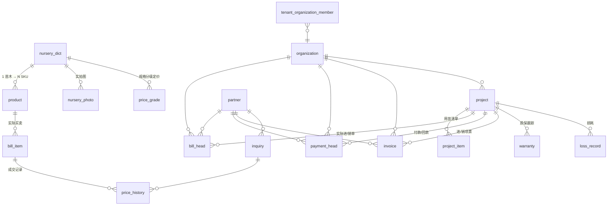

# Horticulture Extension — 苗木 / 园林行业 PRD 扩展

> Tally 第一个真实垂直行业落地：苗木种植 + 园林工程项目核算。
> 客户原型：园林公司 / 苗圃 / 工程方，同一法人下 2 家公司（开票 + 不开票账套）。
> 写于 2026-04-30，授权 = 用户全权 ("自己做最智慧、最有远见的决策")

---

## 1. 客户场景（一天的工作流）

苗木老板（45 岁，山东，15 年从业）：
- 早 8 点：开 Tally → AI Drawer 推日报（付款/收款/缺口/移植窗口）
- 上午：跟客户报价 → ⌘K 搜"红枫" → 看价格历史 → 报价
- 中午：业务员手机录入今日进货（拍照 + 选苗 + 规格 + 数量）
- 下午：财务录回款 + 开销项票
- 晚上：老板手机看大盘（5 个项目损益 / 现金流预测）

业务员（30 岁，常驻基地）：
- 现场用手机扫地块二维码盘点
- 拍照存档（实拍图入苗木字典）
- 录入移植 / 损耗

财务（女，42 岁，PC 党）：
- PC 录款 / 销项票 / 进项票
- 月底跨账套汇总报表

---

## 2. 与现有 Tally 的关系

**保留并复用**：
- `partner` 表（customer + supplier 复用，加 type 字段区分）
- `product` 表（作为"商品 SKU 实例"，挂到苗木字典）
- `bill_head` / `bill_item`（采购 + 销售单，加 `project_id` 字段）
- `payment_head`（付款，加 `project_id` 字段）
- `currency` / `exchange_rate`（按 V1 跨境逻辑可继续，本扩展不动）
- 多 profile 机制（horticulture 作为新 profile）

**新增表**（详见 §4 ERD）：
- `nursery_dict` — 苗木字典（学名 / 拉丁名 / 科属 / 季节）
- `nursery_spec_template` — 规格模板（按苗木类型预定义字段）
- `project` — 项目 / 工程合同
- `project_item` — 项目清单（计划用苗 + 数量）
- `price_grade` — 价格分级（按规格区间 + 客户等级 + 季节）
- `price_history` — 价格历史（每次成交自动记录）
- `inquiry` — 询价记录
- `invoice` — 发票（type=input/output）
- `organization` — 账套 / 子公司
- `tenant_organization_member` — 用户在哪些账套有权限
- `loss_record` — 损耗记录（移植死亡 / 运输损坏）
- `warranty` — 质保期追踪
- `cashflow_forecast_snapshot` — 现金流预测快照（每月生成）
- `nursery_photo` — 苗木实拍图（MinIO key）

**改造现有表**：
- `bill_head`、`bill_item`、`payment_head`、`invoice` 加 `org_id` + `project_id` 字段
- `tenant_profile` 加 `horticulture` profile

---

## 3. 数据模型（核心 ERD）

**共享层**（多账套共用）：`nursery_dict`, `product`, `partner`, `price_grade`, `price_history`
**隔离层**（按 org_id 隔离）：`bill_*`, `payment_head`, `invoice`, `project`, `loss_record`, `warranty`

---

## 4. 关键架构决策

| ID | 决策 | 原因 |
|----|------|------|
| HD-1 | 苗木字典独立表（不是 product category） | 行业知识层 + 实拍图 + 季节窗口 + 规格模板，重于普通商品分类 |
| HD-2 | 价格按 (规格区间 × 客户等级 × 季节) 三维定价 | 苗木价格波动 30-50%，必须分级；行业标杆做法 |
| HD-3 | 多账套同法人 = 轻量级（共享主数据 + 隔离交易） | 不重写 RLS，只在业务表加 org_id WHERE 过滤；账套切换是 UI 操作不是登录边界 |
| HD-4 | 项目 = 一级核算单位 | bill / payment / invoice 都可挂 project_id，缺省可空（散单） |
| HD-5 | 主动 AI（推送）= cron + AI Drawer 通知 | 不是查询式 AI，是"AI 主动告诉你"；落地 V2.5 E23 |
| HD-6 | 移动端优先（PWA）≥ 现场场景 | 业务员 / 仓管 / 老板都用手机；PC 留给财务 |
| HD-7 | Combobox 全站 inline 新增 | 选不到供应商不要让用户跳走；shadcn Command + 抽屉 |
| HD-8 | 苗木字典初始化包（首次 onboarding 内置 200+ 常用苗木） | 客户开箱即用，不必从零录入 |
| HD-9 | 价格历史 + 询价记录是价格分级的"数据燃料" | 没有历史数据就没法智能报价 |
| HD-10 | 质保期 + 损耗率追踪是行业刚需（无人做好） | 差异化卖点 |

---

## 5. Epic 全景（E28-E32）

### E28 — 项目制核算 + 多维度汇总 + 苗木字典 + 价格分级（~180h, 3.5 sprint, 🔴 P0）

> 这一个 epic 承担 60% 的客户感知价值。

| # | Story | 工时 | 关键文件 |
|---|-------|------|---------|
| 28.1 | 苗木字典表 + 基础 CRUD + 200 种初始化包 | 16h | `domain/horticulture/dict.go`, `web/.../dictionary/page.tsx` |
| 28.2 | project 表 + 项目 CRUD + 项目列表页（卡片网格） | 14h | `domain/project/`, `web/.../projects/page.tsx` |
| 28.3 | bill_item / payment_head 加 project_id 关联（migration） | 6h | migration 028 |
| 28.4 | 项目损益视图（成本/利润/应收/回款/未回款，按图1）| 12h | `app/project/pnl.go`, materialized view |
| 28.5 | 按项目汇总 Dashboard（卡片 + 抽屉损益曲线） | 16h | `web/.../projects/[id]/page.tsx` |
| 28.6 | 按供应商汇总（图3：总供货/已开票/未开票/已付/未付） | 14h | `web/.../suppliers/dashboard/page.tsx` |
| 28.7 | 按客户汇总（销售/开票/收款 / 账龄分桶 30/60/90） | 14h | `web/.../customers/dashboard/page.tsx` |
| 28.8 | partner 表加 type + 客户/供应商列表页 | 10h | `web/.../partners/page.tsx` |
| 28.9 | price_grade 表 + 价格分级配置页（规格区间×客户等级×季节）| 16h | `app/price/grade.go` |
| 28.10 | Combobox 全站组件 + inline 新增抽屉（Linear 风格） | 12h | `components/lookup/Combobox.tsx` |
| 28.11 | 行级跳转（项目→供应商；供应商→详情；客户→详情）| 8h | route + drawer wire-in |
| 28.12 | 苗木字典初始化数据（seed 200+ 常用苗木 + 学名/季节）| 8h | `migrations/data/nursery_seed.sql` |
| 28.13 | 苗木字典抽屉详情（图/价格历史/库存/关联项目） | 12h | `web/.../dictionary/[id]/drawer.tsx` |
| 28.14 | 价格历史自动记录（每次成交触发） | 6h | NATS event handler |
| 28.15 | E2E + 单测 + 部署 | 16h | tests + manifest |

### E29 — 进销项发票 + 询价记录 + 价格历史（~70h, 1.5 sprint, 🔴 P0）

| # | Story | 工时 |
|---|-------|------|
| 29.1 | invoice 表（type=input/output）+ 进项票录入 | 12h |
| 29.2 | 销项票开具页 + 与销售单关联 | 12h |
| 29.3 | 销项发票汇总页（按客户/月份） | 10h |
| 29.4 | "供应商是否开票" 列在项目损益表中显示 | 6h |
| 29.5 | inquiry 表 + 询价记录页（按客户 / 苗木查历史报价） | 14h |
| 29.6 | 价格历史曲线组件（Recharts，成交价 + 询价散点） | 10h |
| 29.7 | E2E + 部署 | 6h |

### E30 — 多账套（同法人）+ 账套切换 + 跨账套汇总（~60h, 1 sprint, 🟡 P1）

| # | Story | 工时 |
|---|-------|------|
| 30.1 | organization 表 + tenant_organization_member 表 | 8h |
| 30.2 | 业务表加 org_id（migration + 数据兼容默认 org=tenant_id） | 12h |
| 30.3 | 应用层 org 上下文 + 中间件注入 | 10h |
| 30.4 | 账套切换器（顶部下拉 + Cmd+1/2 + 颜色徽标） | 10h |
| 30.5 | 跨账套汇总报表（老板视角；右上角"全账套"开关）| 12h |
| 30.6 | E2E + 部署 | 8h |

### E31 — 主动智能（季节窗口 / 缺口预警 / 现金流预测 / 质保 / 损耗）（~50h, 1 sprint, 🟡 P1）

| # | Story | 工时 |
|---|-------|------|
| 31.1 | 季节窗口提醒（cron 扫描苗木字典季节字段 → AI Drawer） | 6h |
| 31.2 | 项目缺口预警（项目用苗 vs 库存差额，建议供应商 + 价格） | 10h |
| 31.3 | warranty 表 + 质保期追踪（到期前 7/30 天提醒） | 8h |
| 31.4 | loss_record 表 + 损耗率追踪 + 阈值预警 | 8h |
| 31.5 | 现金流预测（已签未回 + 已订未付 → 月度图） | 12h |
| 31.6 | AI 日报（每天 8 点推送 5 条要点） | 6h |

### E32 — 移动端优先（PWA）+ 现场场景（~80h, 2 sprint, 🟢 P2）

| # | Story | 工时 |
|---|-------|------|
| 32.1 | PWA 安装 + 离线壳（V2.5 E15 提前用） | 12h |
| 32.2 | 现场录单页（拍照 + 选苗 + 规格 + 数量）— 手机优先 | 16h |
| 32.3 | 扫码盘点页（地块二维码 + 苗木数量）| 14h |
| 32.4 | 收款确认页（扫客户码 + 微信/支付宝回调） | 16h |
| 32.5 | 移动端 Dashboard（老板版，4 卡 + 趋势）| 10h |
| 32.6 | 拍照上传到 MinIO + 苗木字典实拍图入库 | 12h |

---

## 6. 阶段里程碑

| 阶段 | 含 | 工时 | 客户能干什么 |
|------|---|------|------------|
| **MVP H1** | E28 | ~180h (3.5 sprint) | 项目核算 + 苗木字典 + 多维度汇总 — 客户可上线试用 |
| **MVP H2** | + E29 | +70h (5 sprint) | 完整进销项票 + 询价/价格历史 — 财务流程完整 |
| **GA H** | + E30 + E31 | +110h (7 sprint) | 多账套 + 主动 AI — 多公司老板版 |
| **Field H** | + E32 | +80h (9 sprint) | 移动端 — 业务员 / 仓管现场化 |

总 ~440h ≈ 9 sprint（单人）/ 5.5 sprint（双人并行）。

---

## 7. UI/UX 关键决策表

| 场景 | 设计 | 行业参照 |
|------|------|---------|
| 项目损益表 | 顶部项目卡（合同/进度/健康度）+ 明细表 + 底部 4 汇总卡 + 右抽屉损益曲线 | Linear Issue 详情 |
| 苗木字典 | 左树形（科属）+ 右表格 + 行点抽屉详情 | Notion DB |
| Combobox 选+新增 | shadcn Command；输入"红枫"→列出+"+新增"→抽屉 5 字段必填 | Linear Backlog |
| 账套切换 | 顶部下拉 + Cmd+1/2 + 颜色徽标（A 蓝 B 绿）| Slack Workspace |
| 主动 AI 日报 | 早 8 点 Drawer 弹出：付款/收款/缺口/移植窗口 | Cron 推送 |
| 现场录单 | 手机优先，拍照→选苗→规格→数量，4 步 < 30 秒 | 美团商家 / 多点 |
| 自然语言查询 | "上月红枫卖多少？" → AI Drawer 答 + 卡片展示 | Linear Asks |

---

## 8. 与现有架构的兼容策略

- **Profile 机制**: 加 `horticulture` 作为第 4 个 profile（cross_border / retail / hybrid / horticulture），onboarding 时选
- **RLS**: 不动现有 RLS（tenant_id），只在业务表加 org_id 作为 WHERE 二级过滤
- **数据迁移**: 现有 tenant 默认 `org_id = tenant_id`（即每个 tenant 等于一个默认账套），向后兼容
- **现有 V1-V3 epics**: E1-E20 不动；E15 PWA 离线壳被 E32 复用提前；E17 Kova 补货 Agent 被 E31.2 项目缺口预警替代或合并
- **V2.5 横向 epics**: E21 草稿/Cmd+Z 已交付；E23 主动 AI 推送的具体落地放到 E31

---

## 9. 待澄清（实施过程中再问客户）

| # | 问题 | 默认假设（实施按此走，客户改时再调） |
|---|------|-------------------------------|
| 1 | 项目质保期标准多长 | 默认 1 年；项目可单独覆盖 |
| 2 | 价格分级阶梯是固定还是自由区间 | 自由区间（更灵活）|
| 3 | 苗木单位 (株/盆/袋/m²) 用户能否自定义 | 内置 8 种 + 自定义 |
| 4 | 损耗率阈值默认多少触发预警 | 默认 10% |
| 5 | 现金流预测时间窗 | 默认未来 90 天 |
| 6 | 苗木字典初始化包数量 | 200 种（覆盖华东 + 华北常见）|
| 7 | AI 日报推送时间 | 默认每天 8:00 本地时间 |
| 8 | 账套切换权限 | 默认 tenant owner 自由切换；员工只能看分配的 |

---

## 10. 入手位置

**第一步**: Story 28.1 — 苗木字典表 + 基础 CRUD + 200 种初始化包（16h）
**理由**: 苗木字典是所有后续 epic 的数据底座；先把它跑通，让用户立刻看到"输入'红枫'有 8 个候选"的体验，再扩散。

下一阶段 = S28.2（project 表 + 列表页）。

---

## 11. Pack 化里程碑

### 当前状态（Track F，2026-05-01）

Sidebar profile gate 已落地：

- `ProfileTypeHorticulture = "horticulture"` 加入 `internal/domain/tenant/` 常量集，并进入 `userSelectableProfiles`（可通过 `IsUserSelectableProfile()` 查询）。
- `ChooseProfileUseCase.Execute()` 验证逻辑更新，horticulture 为合法用户自选 profile。
- 前端 `NavItem.industry?: string[]` 字段落地；`BASE_NAV_ITEMS` 中"苗木字典"标注 `industry: ["horticulture"]`，对 cross_border / retail / hybrid tenant 不可见。
- `/setup` 页增加苗木 / 园林工程选项卡片；`ProfileType`（`lib/api/me.ts` + `lib/profile.tsx`）已扩展。

### 下一阶段（占位 Story 28.X，待规划）

把 `internal/{domain,app,adapter}/horticulture/` 抽成独立可拔插模块：

- 独立目录 `internal/domain/horticulture/`、`internal/app/horticulture/`、`internal/adapter/{handler,repo}/horticulture/`
- 生命周期注册：在 `lifecycle/wire.go` 中按 `tenant_profile.profile_type == 'horticulture'` 条件挂载路由
- 前端 feature flag 也改为按 `profileType === 'horticulture'` 动态 import

**红线**：core（products / purchases / sales / payments）不得 import horticulture pack；horticulture pack 可 import core domain 类型。
